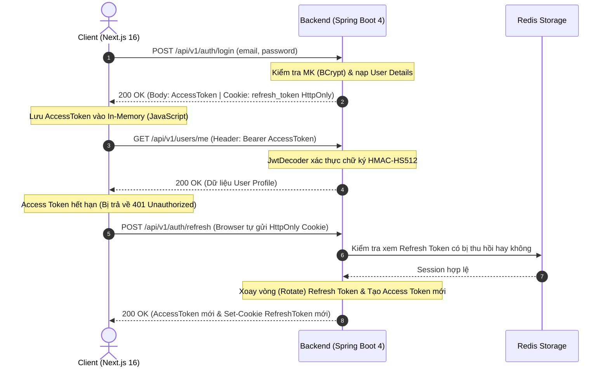
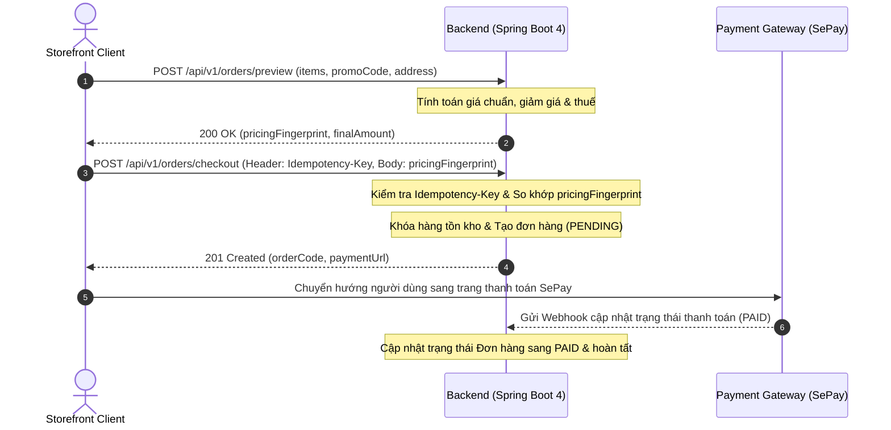

# Vela Wear Backend

[](https://github.com/conqazht/VelaWear_BE)

RESTful API backend cho ứng dụng thương mại điện tử thời trang cao cấp Vela Wear.

## Tech Stack

Dự án được xây dựng dựa trên các công nghệ và thư viện hiện đại:

| Công nghệ / Thư viện | Phiên bản / Mô tả |
| --- | --- |
| **Java** | 25 |
| **Spring Boot** | 4.0.7 |
| **Spring Framework** | 7 |
| **Spring Security** | 7 + oauth2-resource-server (JWT HS512) |
| **Spring Data JPA** | + PostgreSQL 16 |
| **Redis** | session tracking, token revocation, OTP, rate limiting |
| **Flyway** | database migrations |
| **Lombok** | Giảm thiểu boilerplate code |
| **SpringDoc OpenAPI** | 3.0.2 (Swagger) |
| **Resend** | email OTP |
| **Testcontainers** | 2.0.5 (PostgreSQL for tests) |
| **Testing** | JUnit 6 + Mockito + MockMvc |
| **Build Tool** | Maven |
| **Google OAuth2** | social login |
| **SePay** | payment gateway |
| **Gemini API** | AI-powered Vietnamese → English content translation |

## Infrastructure

- `docker-compose.yml` cung cấp PostgreSQL 16-alpine và Redis 8.8.0.
- Spring Boot Docker Compose support tự động khởi chạy các containers trong môi trường dev.
- Profiles hỗ trợ: `dev`, `prod`, `test`.
- Flyway quản lý toàn bộ schema migrations, các script nằm tại thư mục `src/main/resources/db/`.

## Feature Modules

Hệ thống được chia thành 25 package nghiệp vụ (features) bên trong thư mục `feature/`:
`auth`, `brand`, `cart`, `catalog`, `category`, `checkout`, `color`, `coupon`, `file`, `home`, `order`, `payment`, `permission`, `product`, `productvariant`, `refreshtoken`, `review`, `role`, `salecampaign`, `size`, `socialaccount`, `storefrontcatalog`, `user`, `useraddress`, `wishlist`.

## Package Structure

```text
vn.conganh.commercial/
├── CommercialApplication.java
├── config/          # SecurityConfig, JwtConfig, CorsConfig, OpenApiConfig, RedisConfig
├── security/        # SecurityUtil, CustomUserDetailsService, JwtSecurityFilter
├── exception/       # GlobalExceptionHandler, AppException hierarchy
├── dto/             # ApiResponse<T>, ResultPaginationDTO<T>, shared DTOs
├── feature/         # 25 business feature modules
│   └── {feature}/
│       ├── {Feature}Controller.java
│       ├── {Feature}Service.java (interface)
│       ├── {Feature}ServiceImpl.java
│       ├── {Feature}Repository.java
│       ├── {Feature}.java (entity)
│       ├── {Feature}Specification.java (filter)
│       ├── dto/
│       └── CONTEXT.md
├── util/            # Static utilities
└── resources/
    ├── application.yaml
    ├── application-dev.yml
    ├── application-prod.yml
    ├── application-test.yml
    ├── db/           # Flyway migrations
    └── redis/        # Redis Lua scripts
```

## Security Architecture

- **JWT**: Sử dụng oauth2-resource-server, mã hóa bằng thuật toán HS512 (symmetric keys).
- **Thời gian sống của token**: Access token (15 phút), refresh token (3 ngày).
- **Refresh Token**: Lưu trữ trong Redis, sử dụng cơ chế CAS rotation và revocation. Cookie HttpOnly được thiết lập cho refresh token tại `Path=/api/v1/auth`.
- **OTP**: Cơ chế challenge/proof với rate limiting, cooldown và max attempts lock để chống brute-force.
- **RBAC**: Entity Permission ánh xạ (`apiPath` + `httpMethod`) sang Role tương ứng.
- **Social Login**: Hỗ trợ Google OAuth2 thông qua luồng authorization code exchange.

## API Convention

- **Base URL**: `/api/v1`
- **Tên Endpoint**: Dùng danh từ số nhiều, định dạng kebab-case (VD: `/api/v1/product-variants`, `/api/v1/user-addresses`).
- **Self-scoped Customer APIs**: Dùng cho user đang đăng nhập (VD: `/users/me`, `/orders/me`, `/user-addresses/me`).
- **Standard Wrapper**: Mọi response đều được bọc trong `ApiResponse<T>` chứa `statusCode`, `data`, `message`, `code`, `timestamp`.
- **Pagination**: Đánh chỉ mục từ 1 (`page=1` là trang đầu tiên), hỗ trợ `size`, `sort=field,direction`.
- **Validation**: Lỗi HTTP 400 sẽ trả về map các lỗi validation theo field trong thuộc tính `data`.

## Luồng Tích Hợp End-to-End (FE ↔ BE Flow)

Hệ thống giữa Frontend (Next.js 16) và Backend (Spring Boot 4) phối hợp xử lý qua 2 luồng cốt lõi:

### 1. Luồng Xác Thực & Quản Lý Token (Authentication & Token Refresh)



### 2. Luồng Đặt Hàng & Thanh Toán (Checkout & Payment Flow)



## Environment Variables

Tạo file `.env` từ template `.env.example` và thiết lập các giá trị phù hợp:

```env
# Spring Profile & Server Port
SPRING_PROFILES_ACTIVE=dev                        # Profile kích hoạt: dev, prod, test
SERVER_PORT=8080                                  # Cổng chạy ứng dụng Backend

# Database Settings (PostgreSQL 16)
DB_NAME=VelaWear                                  # Tên cơ sở dữ liệu
DB_URL=jdbc:postgresql://localhost:5432/VelaWear  # JDBC URL kết nối PostgreSQL
DB_USERNAME=postgres                              # Tên đăng nhập DB
DB_PASSWORD=your_db_password                      # Mật khẩu DB

# Redis Settings (Session tracking, Token Revocation, OTP, Rate Limiting)
REDIS_HOST=localhost                              # Host Redis server
REDIS_PORT=6379                                   # Port Redis server
REDIS_PASSWORD=                                   # Mật khẩu Redis (để trống nếu dev)

# Security, Rate Limiting & OTP
SECURITY_HMAC_SECRET=generate_random_secret_32b  # Khóa HMAC bảo mật nội bộ (tối thiểu 32 bytes)
SERVER_FORWARD_HEADERS_STRATEGY=NONE              # Chiến lược forward headers (NONE / NATIVE)
TRUSTED_PROXY_REGEX=(?!)                          # Regex IP proxy tin cậy (khi NATIVE)
AUTH_RATE_LIMIT_ENABLED=true                      # Bật/tắt rate limit tính năng auth
OTP_REQUEST_COOLDOWN=60s                          # Thời gian chờ giữa 2 lần gửi OTP
OTP_MAX_ATTEMPTS=5                                # Số lần nhập sai OTP tối đa
OTP_ATTEMPTS_LOCK=10m                             # Thời gian khóa khi nhập sai quá hạn

# JWT Security (Khóa HS512 tối thiểu 64 ký tự)
JWT_ACCESS_TOKEN_SECRET_KEY=generate_access_key_64c   # Khóa bí mật ký Access Token
JWT_REFRESH_TOKEN_SECRET_KEY=generate_refresh_key_64c # Khóa bí mật ký Refresh Token
JWT_ACCESS_TOKEN_EXPIRATION=900                       # Thời gian sống Access Token (15 phút)
JWT_REFRESH_TOKEN_EXPIRATION=259200                   # Thời gian sống Refresh Token (3 ngày)

# File Upload Settings
UPLOAD_BASE_DIR=uploads                           # Thư mục lưu trữ file
UPLOAD_URL_PREFIX=/uploads                        # Prefix URL truy cập file
UPLOAD_MAX_SIZE_BYTES=5242880                     # Dung lượng tối đa: 5MB
UPLOAD_MAX_FILE_SIZE=5MB                          # Giới hạn file tải lên
UPLOAD_MAX_REQUEST_SIZE=6MB                       # Giới hạn tổng request
UPLOAD_ALLOWED_EXTENSIONS=jpg,jpeg,png,gif,webp   # Định dạng file cho phép
UPLOAD_ALLOWED_FOLDERS=avatars,logos              # Thư mục con cho phép

# Swagger Documentation (dev profile)
SWAGGER_UI_ENABLED=true                           # Bật/tắt giao diện Swagger UI
OPENAPI_DOCS_ENABLED=true                         # Bật/tắt OpenAPI docs

# Resend Email Settings
RESEND_API_KEY=your_resend_api_key_here           # API Key dịch vụ Resend gửi email OTP
RESEND_FROM_EMAIL=onboarding@resend.dev           # Địa chỉ email người gửi

# Gemini AI Content Translation (VI -> EN)
ENGLISH_CONTENT_ENABLED=false                     # Bật/tắt gợi ý dịch thuật bằng AI
GEMINI_API_KEY=your_gemini_api_key_here           # API Key Gemini
GEMINI_DEFAULT_MODEL=gemini-3.1-flash-lite        # Model Gemini mặc định
GEMINI_BASE_URL=https://generativelanguage.googleapis.com/v1beta
GEMINI_CONNECT_TIMEOUT=3s                         # Timeout kết nối
GEMINI_READ_TIMEOUT=30s                           # Timeout đọc phản hồi
ENGLISH_CONTENT_MAX_INPUT_CHARACTERS=30000        # Giới hạn ký tự đầu vào
ENGLISH_CONTENT_MAX_OUTPUT_TOKENS=16384           # Giới hạn token đầu ra

# SePay Payment Gateway
SEPAY_ENABLED=false                               # Bật/tắt cổng thanh toán SePay
SEPAY_ENVIRONMENT=production                      # Môi trường SePay (sandbox / production)
SEPAY_MERCHANT_ID=SP-LIVE-your-merchant-id        # Merchant ID SePay
SEPAY_SECRET_KEY=spsk_live_your-secret-key        # Secret Key SePay
SEPAY_CHECKOUT_URL=https://pay.sepay.vn/v1/checkout/init
SEPAY_SUCCESS_URL=https://your-frontend-domain/payment/success
SEPAY_ERROR_URL=https://your-frontend-domain/payment/error
SEPAY_CANCEL_URL=https://your-frontend-domain/payment/cancel

# Google OAuth2 Login
GOOGLE_CLIENT_ID=your_google_oauth_client_id       # Google OAuth2 Client ID
GOOGLE_CLIENT_SECRET=your_google_oauth_client_secret # Google OAuth2 Client Secret
OAUTH2_FRONTEND_SUCCESS_URL=http://localhost:3000/auth/oauth2/callback
OAUTH2_FRONTEND_FAILURE_URL=http://localhost:3000/sign-in
OAUTH2_LOGIN_CODE_TTL_SECONDS=120                 # Thời gian sống code login (2 phút)
OAUTH2_AUTHORIZATION_REQUEST_TTL_SECONDS=180      # Thời gian sống request auth (3 phút)
```

## Setup Instructions

1. **Yêu cầu hệ thống**: Cài đặt Java 25, Maven, và Docker (dùng để chạy PostgreSQL + Redis).
2. **Clone repo**: Clone mã nguồn dự án từ GitHub.
3. **Cấu hình môi trường**: Copy file `.env.example` thành `.env`, điền đầy đủ các thông tin credentials.
4. **Khởi chạy Infrastructure**: Docker compose sẽ được tự động khởi chạy nhờ Spring Boot Docker Compose support. Nếu muốn chạy thủ công: `docker compose up -d`.
5. **Chạy ứng dụng**: Chạy lệnh `./mvnw spring-boot:run` trên terminal hoặc chạy trực tiếp thông qua IntelliJ IDEA.
6. **Truy cập Swagger UI**: Khám phá và test API tại `http://localhost:8080/swagger-ui.html`.
7. **Kiểm tra Actuator health**: Xem trạng thái ứng dụng tại `http://localhost:8080/actuator/health`.

## Testing

- Dự án có tổng cộng 94 test files trải dài trên các tính năng.
- **Unit tests**: Sử dụng `@ExtendWith(MockitoExtension.class)` và Mockito.
- **Integration tests**: Sử dụng `@SpringBootTest` kết hợp MockMvc, `@ActiveProfiles("test")`, và Testcontainers (PostgreSQL).
- **Chạy tests**: Dùng lệnh `./mvnw test`.
- **Lưu ý quan trọng**: Surefire plugin sử dụng Mockito agent, chạy với flag `-javaagent:mockito-core.jar -Xshare:off`. **KHÔNG SỬ DỤNG** database H2 cho việc test; luôn ưu tiên sử dụng Testcontainers với PostgreSQL.

## Documentation References

Các tài liệu chi tiết được lưu trong thư mục `docs/`:

- [Kiến trúc hệ thống](docs/ARCHITECTURE.md)
- [Đặc tả API](docs/API_SPEC.md)
- [Database schema](docs/DATABASE.md)
- [Quy ước lập trình](docs/PROJECT-RULES.md)
- [Tiến độ dự án](docs/PROJECT-STATUS.md)
- [Flyway migrations](docs/FLYWAY.md)
- [Chiến lược refresh token](docs/decisions/refresh-token-strategy.md)
- [Storefront catalog UX](docs/STOREFRONT_CATALOG_UX_BACKEND_VI.md)
- [Bảo mật OTP/Auth](docs/OTP_SECURITY_FLOW_VI.md)
- [Kiểm thử race condition](docs/RACE_CONDITION_TESTING_VI.md)
- [Sale campaign backend](docs/SALE_CAMPAIGN_BACKEND.md)
- [Hướng dẫn i18n catalog](docs/I18N_CATALOG_SALE_VI.md)

## Lộ Trình Cải Tiến & Refactoring (Improvement Plans)

Các kế hoạch trong thư mục `plans/` được tạo ra từ đợt audit nâng cao chất lượng codebase (shadcn/improve audit), dùng để quản lý các đợt refactoring, tối ưu hiệu năng, thắt chặt bảo mật và bảo trì hệ thống qua 5 đợt (waves):

- [Lộ trình cải tiến Backend (tiếng Việt)](plans/README.vi.md)
- [Improvement Plans Index (English)](plans/README.md)

*Lưu ý: Thư mục `plans/` tập trung vào lộ trình refactoring và tối ưu hóa hệ thống, các tài liệu đặc tả nghiệp vụ chính nằm trong thư mục `docs/`.*
