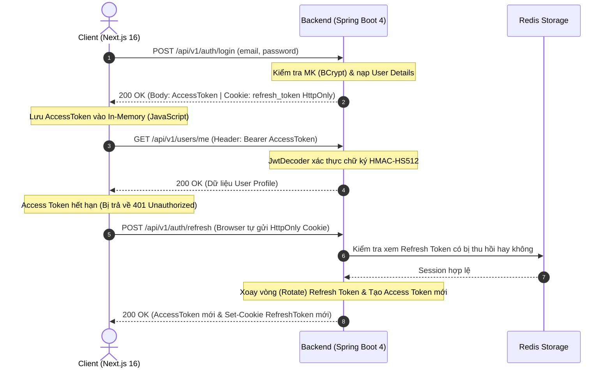
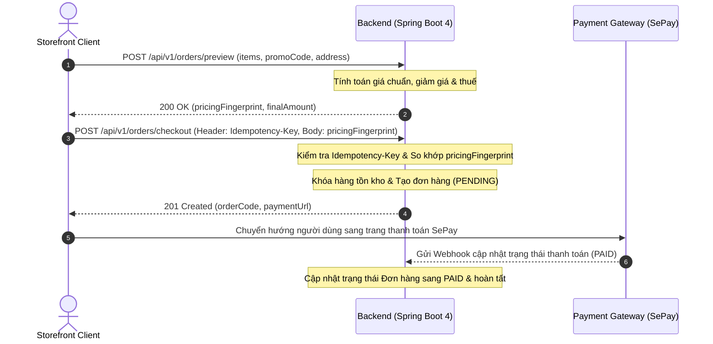

# Vela Wear Backend (VelaWear_BE)

[](https://github.com/conqazht/VelaWear_BE)

RESTful API backend cho ứng dụng thương mại điện tử thời trang cao cấp Vela Wear.

## Tech Stack

Dự án được xây dựng dựa trên các công nghệ và thư viện hiện đại:

| Công nghệ / Thư viện | Phiên bản / Mô tả |
| --- | --- |
| **Java** | 25 |
| **Spring Boot** | 4.0.7 |
| **Spring Framework** | 7 |
| **Spring Security** | 7 + oauth2-resource-server (JWT HS512) |
| **Spring Data JPA** | + PostgreSQL 16 |
| **Redis** | session tracking, token revocation, OTP, rate limiting |
| **Flyway** | database migrations |
| **Lombok** | Giảm thiểu boilerplate code |
| **SpringDoc OpenAPI** | 3.0.2 (Swagger) |
| **Resend** | email OTP |
| **Testcontainers** | 2.0.5 (PostgreSQL for tests) |
| **Testing** | JUnit 6 + Mockito + MockMvc |
| **Build Tool** | Maven |
| **Google OAuth2** | social login |
| **SePay** | payment gateway |
| **Gemini API** | AI-powered Vietnamese → English content translation |

## Infrastructure

- `docker-compose.yml` cung cấp PostgreSQL 16-alpine và Redis 8.8.0.
- Spring Boot Docker Compose support tự động khởi chạy các containers trong môi trường dev.
- Profiles hỗ trợ: `dev`, `prod`, `test`.
- Flyway quản lý toàn bộ schema migrations, các script nằm tại thư mục `src/main/resources/db/`.

## Feature Modules

Hệ thống được chia thành 25 package nghiệp vụ (features) bên trong thư mục `feature/`:
`auth`, `brand`, `cart`, `catalog`, `category`, `checkout`, `color`, `coupon`, `file`, `home`, `order`, `payment`, `permission`, `product`, `productvariant`, `refreshtoken`, `review`, `role`, `salecampaign`, `size`, `socialaccount`, `storefrontcatalog`, `user`, `useraddress`, `wishlist`.

## Package Structure

```text
vn.conganh.commercial/
├── CommercialApplication.java
├── config/          # SecurityConfig, JwtConfig, CorsConfig, OpenApiConfig, RedisConfig
├── security/        # SecurityUtil, CustomUserDetailsService, JwtSecurityFilter
├── exception/       # GlobalExceptionHandler, AppException hierarchy
├── dto/             # ApiResponse<T>, ResultPaginationDTO<T>, shared DTOs
├── feature/         # 25 business feature modules
│   └── {feature}/
│       ├── {Feature}Controller.java
│       ├── {Feature}Service.java (interface)
│       ├── {Feature}ServiceImpl.java
│       ├── {Feature}Repository.java
│       ├── {Feature}.java (entity)
│       ├── {Feature}Specification.java (filter)
│       ├── dto/
│       └── CONTEXT.md
├── util/            # Static utilities
└── resources/
    ├── application.yaml
    ├── application-dev.yml
    ├── application-prod.yml
    ├── application-test.yml
    ├── db/           # Flyway migrations
    └── redis/        # Redis Lua scripts
```

## Security Architecture

- **JWT**: Sử dụng oauth2-resource-server, mã hóa bằng thuật toán HS512 (symmetric keys).
- **Thời gian sống của token**: Access token (15 phút), refresh token (3 ngày).
- **Refresh Token**: Lưu trữ trong Redis, sử dụng cơ chế CAS rotation và revocation. Cookie HttpOnly được thiết lập cho refresh token tại `Path=/api/v1/auth`.
- **OTP**: Cơ chế challenge/proof với rate limiting, cooldown và max attempts lock để chống brute-force.
- **RBAC**: Entity Permission ánh xạ (`apiPath` + `httpMethod`) sang Role tương ứng.
- **Social Login**: Hỗ trợ Google OAuth2 thông qua luồng authorization code exchange.

## API Convention

- **Base URL**: `/api/v1`
- **Tên Endpoint**: Dùng danh từ số nhiều, định dạng kebab-case (VD: `/api/v1/product-variants`, `/api/v1/user-addresses`).
- **Self-scoped Customer APIs**: Dùng cho user đang đăng nhập (VD: `/users/me`, `/orders/me`, `/user-addresses/me`).
- **Standard Wrapper**: Mọi response đều được bọc trong `ApiResponse<T>` chứa `statusCode`, `data`, `message`, `code`, `timestamp`.
- **Pagination**: Đánh chỉ mục từ 1 (`page=1` là trang đầu tiên), hỗ trợ `size`, `sort=field,direction`.
- **Validation**: Lỗi HTTP 400 sẽ trả về map các lỗi validation theo field trong thuộc tính `data`.

## Luồng Tích Hợp End-to-End (FE ↔ BE Flow)

Hệ thống giữa Frontend (Next.js 16) và Backend (Spring Boot 4) phối hợp xử lý qua 2 luồng cốt lõi:

### 1. Luồng Xác Thực & Quản Lý Token (Authentication & Token Refresh)



### 2. Luồng Đặt Hàng & Thanh Toán (Checkout & Payment Flow)



## Environment Variables

Cấu hình các biến môi trường thiết yếu dựa trên `.env.example`:

### 1. Spring Profile & Server Port
| Biến | Ý nghĩa |
| --- | --- |
| `SPRING_PROFILES_ACTIVE` | Kích hoạt profile (dev, prod, test) |
| `SERVER_PORT` | Cổng chạy ứng dụng |

### 2. Database
| Biến | Ý nghĩa |
| --- | --- |
| `DB_NAME` | Tên database |
| `DB_URL` | JDBC URL kết nối PostgreSQL |
| `DB_USERNAME` | Tên đăng nhập DB |
| `DB_PASSWORD` | Mật khẩu DB |

### 3. Redis
| Biến | Ý nghĩa |
| --- | --- |
| `REDIS_HOST` | Host của Redis server |
| `REDIS_PORT` | Port của Redis |
| `REDIS_PASSWORD` | Mật khẩu truy cập Redis |

### 4. Security, Rate Limiting & OTP Settings
| Biến | Ý nghĩa |
| --- | --- |
| `SECURITY_HMAC_KEY` | Khóa HMAC dùng cho bảo mật nội bộ |
| `FORWARD_HEADERS_STRATEGY` | Chiến lược xử lý forward headers |
| `RATE_LIMIT_...` | Các cấu hình giới hạn số lượng request |
| `OTP_...` | Cấu hình cho tính năng gửi OTP (cooldown, max attempts, v.v.) |

### 5. JWT Keys & Expiration
| Biến | Ý nghĩa |
| --- | --- |
| `JWT_SECRET` | Khóa bí mật ký JWT (HS512) |
| `JWT_EXPIRATION` | Thời gian sống của JWT Access Token |
| `JWT_REFRESH_EXPIRATION` | Thời gian sống của JWT Refresh Token |

### 6. File Upload Settings
| Biến | Ý nghĩa |
| --- | --- |
| `FILE_UPLOAD_DIR` | Thư mục lưu trữ file upload |
| `MAX_FILE_SIZE` | Giới hạn dung lượng file tải lên |

### 7. Swagger
| Biến | Ý nghĩa |
| --- | --- |
| `SWAGGER_ENABLED` | Bật/tắt giao diện Swagger UI |

### 8. Resend Email
| Biến | Ý nghĩa |
| --- | --- |
| `RESEND_API_KEY` | API key để tích hợp với Resend gửi email |

### 9. Gemini AI Content
| Biến | Ý nghĩa |
| --- | --- |
| `GEMINI_API_KEY` | API key kết nối tới Gemini AI (dịch nội dung tiếng Việt -> Anh) |

### 10. SePay Payment Gateway
| Biến | Ý nghĩa |
| --- | --- |
| `SEPAY_API_KEY` | Khóa API tích hợp thanh toán qua SePay |
| `SEPAY_WEBHOOK_SECRET` | Secret xác thực Webhook từ SePay |

### 11. Google OAuth2
| Biến | Ý nghĩa |
| --- | --- |
| `GOOGLE_CLIENT_ID` | Client ID của Google OAuth2 |
| `GOOGLE_CLIENT_SECRET` | Client Secret của Google OAuth2 |

## Setup Instructions

1. **Yêu cầu hệ thống**: Cài đặt Java 25, Maven, và Docker (dùng để chạy PostgreSQL + Redis).
2. **Clone repo**: Clone mã nguồn dự án từ GitHub.
3. **Cấu hình môi trường**: Copy file `.env.example` thành `.env`, điền đầy đủ các thông tin credentials.
4. **Khởi chạy Infrastructure**: Docker compose sẽ được tự động khởi chạy nhờ Spring Boot Docker Compose support. Nếu muốn chạy thủ công: `docker compose up -d`.
5. **Chạy ứng dụng**: Chạy lệnh `./mvnw spring-boot:run` trên terminal hoặc chạy trực tiếp thông qua IntelliJ IDEA.
6. **Truy cập Swagger UI**: Khám phá và test API tại `http://localhost:8080/swagger-ui.html`.
7. **Kiểm tra Actuator health**: Xem trạng thái ứng dụng tại `http://localhost:8080/actuator/health`.

## Testing

- Dự án có tổng cộng 94 test files trải dài trên các tính năng.
- **Unit tests**: Sử dụng `@ExtendWith(MockitoExtension.class)` và Mockito.
- **Integration tests**: Sử dụng `@SpringBootTest` kết hợp MockMvc, `@ActiveProfiles("test")`, và Testcontainers (PostgreSQL).
- **Chạy tests**: Dùng lệnh `./mvnw test`.
- **Lưu ý quan trọng**: Surefire plugin sử dụng Mockito agent, chạy với flag `-javaagent:mockito-core.jar -Xshare:off`. **KHÔNG SỬ DỤNG** database H2 cho việc test; luôn ưu tiên sử dụng Testcontainers với PostgreSQL.

## Documentation References

Các tài liệu chi tiết được lưu trong thư mục `docs/`:

- [Kiến trúc hệ thống](docs/ARCHITECTURE.md)
- [Đặc tả API](docs/API_SPEC.md)
- [Database schema](docs/DATABASE.md)
- [Quy ước lập trình](docs/PROJECT-RULES.md)
- [Tiến độ dự án](docs/PROJECT-STATUS.md)
- [Flyway migrations](docs/FLYWAY.md)
- [Chiến lược refresh token](docs/decisions/refresh-token-strategy.md)
- [Storefront catalog UX](docs/STOREFRONT_CATALOG_UX_BACKEND_VI.md)
- [Bảo mật OTP/Auth](docs/OTP_SECURITY_FLOW_VI.md)
- [Kiểm thử race condition](docs/RACE_CONDITION_TESTING_VI.md)
- [Sale campaign backend](docs/SALE_CAMPAIGN_BACKEND.md)
- [Hướng dẫn i18n catalog](docs/I18N_CATALOG_SALE_VI.md)

## Implementation Plans

Theo dõi lộ trình phát triển và các giai đoạn triển khai tại thư mục `plans/`:

- [Lộ trình triển khai Backend (tiếng Việt)](plans/README.vi.md)
- [Implementation Plans (English)](plans/README.md)

Các kế hoạch bao gồm 15 bản kế hoạch (plans) được chia làm 5 làn sóng (waves) chính: security hardening → performance optimization → orchestration refactoring → maintenance.
