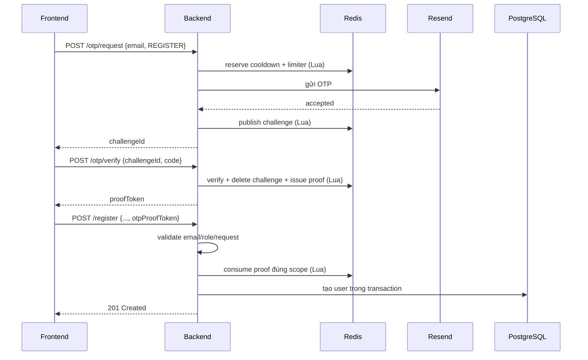
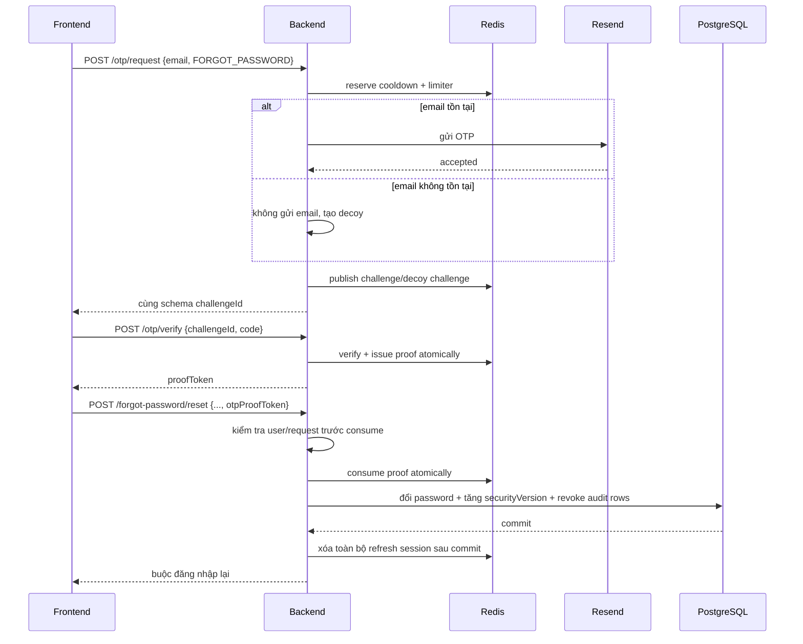
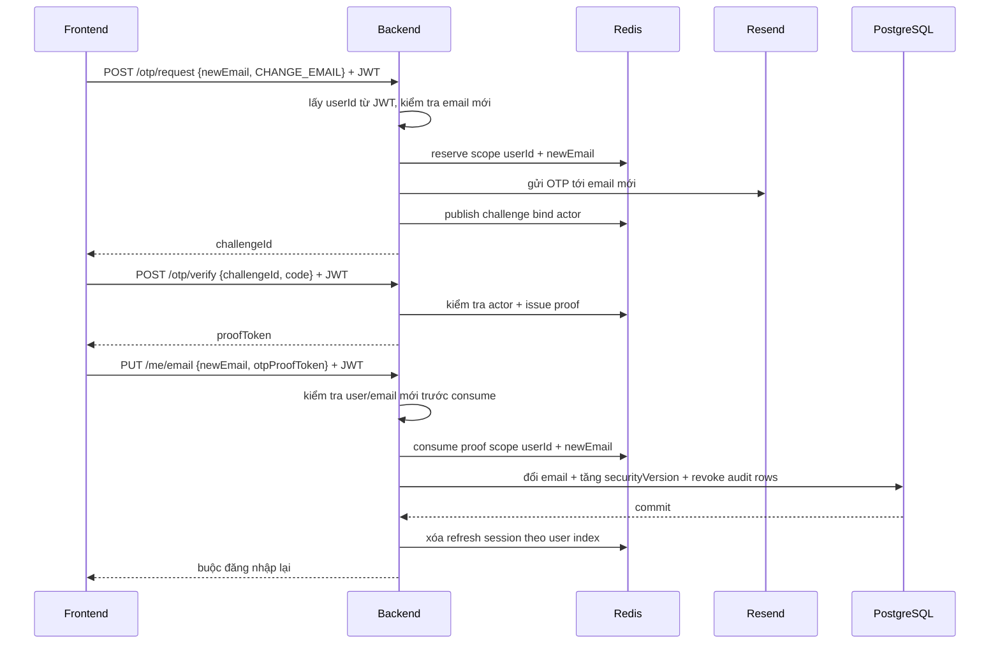

# Hardening OTP/Auth v1

Tài liệu này mô tả luồng OTP/Auth đã được hardening ở backend VelaWear. Mục tiêu
là giúp người phát triển hiểu vì sao từng lớp bảo vệ tồn tại, frontend phải gọi API
theo thứ tự nào, Redis giữ invariant gì và phải kiểm tra đâu khi hệ thống có sự cố.

Phạm vi v1 gồm năm lớp:

1. challenge OTP, proof token dùng một lần và Redis Lua nguyên tử;
2. rate limit đa chiều cho các endpoint Auth/OTP;
3. xác định client IP an toàn, không tin header do client tự gửi;
4. thu hồi toàn bộ session bằng `securityVersion`;
5. log/metric nội bộ bằng Spring Boot Actuator và Micrometer.

V1 **không** tích hợp Cloudflare, WAF, CAPTCHA, Prometheus, Grafana hoặc SaaS bảo
mật mới. Resend vẫn là nhà cung cấp gửi email hiện có. Rate limiter tầng ứng dụng
không thay thế biện pháp chống DDoS volumetric ở edge/upstream.

## 1. Thuật ngữ

| Thuật ngữ | Ý nghĩa | Không phải |
|---|---|---|
| OTP | Mã sáu chữ số, sống 5 phút, được gửi qua email | Mật khẩu hoặc session đăng nhập |
| `purpose` | Mục đích của OTP: `REGISTER`, `FORGOT_PASSWORD`, `CHANGE_EMAIL` | Dữ liệu frontend được quyền đổi ở bước cuối |
| `challengeId` | Chuỗi ngẫu nhiên 32 byte, Base64URL 43 ký tự, trỏ đến challenge trong Redis | OTP, proof hoặc access token |
| Challenge | Trạng thái đang chờ verify, bind với scope, purpose và actor | Trạng thái đã được phép đổi dữ liệu |
| Proof token | Bằng chứng ngắn hạn cho biết challenge đã verify thành công; chỉ dùng một lần | JWT đăng nhập, refresh token hoặc quyền gọi API khác |
| Scope | HMAC của `purpose + email đã normalize + actor`; xác định proof được phép dùng ở đâu | Email/IP thô trong Redis key |
| Actor | User đang đăng nhập; chỉ bắt buộc với `CHANGE_EMAIL` | Người nhận email OTP |
| Consume | Kiểm tra scope và xóa proof nguyên tử ngay trước mutation DB | Chỉ đọc hoặc đánh dấu proof là đã dùng ở bước sau |
| `securityVersion` | Số phiên bản bảo mật của user trong PostgreSQL và JWT/session Redis | Phiên bản ứng dụng hoặc JWT key version |
| Dimension | Một góc nhìn của limiter, ví dụ IP, account, email, user, refresh JTI | Browser fingerprint |

### Proof token dùng để làm gì?

Proof token tách hai hành động khác nhau:

1. `/otp/verify` chỉ chứng minh người dùng biết mã OTP của một challenge cụ thể;
2. endpoint cuối mới thực hiện đăng ký, reset password hoặc đổi email.

Nhờ vậy endpoint verify không phải nhận password, profile hoặc mutation nhạy cảm.
Backend có thể bind proof với đúng email, purpose và user; một proof của đăng ký
không thể đem sang reset password, proof đổi email của user A không thể dùng cho
user B. Lua consume xóa proof trong cùng thao tác kiểm tra nên hai request đồng thời
dùng chung token chỉ có một request thắng.

Frontend chỉ giữ proof trong memory của callback/flow hiện tại, gửi nó vào endpoint
cuối rồi bỏ. Không lưu proof vào local storage, cookie, URL, log hoặc analytics.

## 2. Contract API v2

Tất cả payload thành công/lỗi vẫn nằm trong envelope `ApiResponse` hiện có. Các ví
dụ dưới đây chỉ dùng timestamp minh họa.

### 2.1 Request OTP

`POST /api/v1/auth/otp/request`

```json
{
  "email": "customer@example.com",
  "purpose": "REGISTER"
}
```

```json
{
  "statusCode": 200,
  "data": {
    "challengeId": "x7P5v6cWn0L9R3K1t2A8e4FqBzJmYuSdHiGoNcVXQ_k",
    "expiresInSeconds": 300,
    "cooldownSeconds": 60
  },
  "message": "Verification code sent successfully",
  "timestamp": "2026-07-16T10:00:00"
}
```

Quy tắc:

- `REGISTER` và `FORGOT_PASSWORD` là public.
- `CHANGE_EMAIL` bắt buộc Bearer JWT; challenge bind với `userId` trong JWT và
  email mới.
- Email được trim và lowercase bằng `Locale.ROOT` trước khi tạo scope.
- Với `FORGOT_PASSWORD`, email không tồn tại vẫn nhận cùng status/schema và một
  decoy challenge; backend không gửi email. Đây là biện pháp giảm account
  enumeration.
- Request bị cooldown hoặc quota trả `429 OTP_RATE_LIMITED`.

### 2.2 Verify OTP

`POST /api/v1/auth/otp/verify`

```json
{
  "challengeId": "x7P5v6cWn0L9R3K1t2A8e4FqBzJmYuSdHiGoNcVXQ_k",
  "code": "123456"
}
```

```json
{
  "statusCode": 200,
  "data": {
    "proofToken": "zQ8M5gHlKcJw3tP2vYn0dSbArExUiFoN6R9W1aD7C4k",
    "expiresInSeconds": 300
  },
  "message": "Verification code verified successfully",
  "timestamp": "2026-07-16T10:01:00"
}
```

Request verify không nhận lại email hoặc purpose. Binding được đọc từ challenge đã
tạo trước đó, vì vậy client không thể đổi purpose/email ở bước verify. Khi purpose
là `CHANGE_EMAIL`, JWT hiện tại phải thuộc đúng actor đã request challenge.

### 2.3 Dùng proof ở endpoint cuối

Backend tự chọn purpose dựa trên endpoint; client không gửi purpose lần nữa.

Đăng ký:

```http
POST /api/v1/auth/register
```

```json
{
  "email": "customer@example.com",
  "password": "password123",
  "fullName": "Nguyen Van A",
  "birthDate": "2000-01-01",
  "avatar": null,
  "gender": "MALE",
  "otpProofToken": "zQ8M5gHlKcJw3tP2vYn0dSbArExUiFoN6R9W1aD7C4k"
}
```

Reset password:

```http
POST /api/v1/auth/forgot-password/reset
```

```json
{
  "email": "customer@example.com",
  "newPassword": "newPassword123",
  "otpProofToken": "zQ8M5gHlKcJw3tP2vYn0dSbArExUiFoN6R9W1aD7C4k"
}
```

Đổi email:

```http
PUT /api/v1/auth/me/email
Authorization: Bearer <access-token>
```

```json
{
  "newEmail": "newemail@example.com",
  "otpProofToken": "zQ8M5gHlKcJw3tP2vYn0dSbArExUiFoN6R9W1aD7C4k"
}
```

Reset password, đổi password và đổi email trả cùng cờ buộc đăng nhập lại:

```json
{
  "statusCode": 200,
  "data": {
    "allSessionsRevoked": true,
    "reauthenticationRequired": true
  },
  "message": "Password reset successfully",
  "timestamp": "2026-07-16T10:02:00"
}
```

Response đồng thời xóa refresh-token cookie. Frontend phải xóa access token, auth
cache và dữ liệu gắn với session, sau đó chuyển về trang đăng nhập; không gọi
refresh/check-session thêm bằng token cũ.

## 3. Ba sequence flow OTP

### 3.1 Đăng ký



Proof bind với `REGISTER + normalizedEmail + no-actor`.

### 3.2 Quên mật khẩu



Người dùng của email không tồn tại không nhận được mã nên decoy challenge không thể
hoàn thành, nhưng response request không tiết lộ sự khác biệt.

### 3.3 Đổi email



Nếu user đổi giữa bước request/verify/final hoặc `newEmail` ở bước cuối khác email đã
request, scope không khớp và proof bị từ chối.

## 4. OTP/proof trong Redis

### 4.1 Sinh token và HMAC

- `challengeId` và proof token dùng `SecureRandom` 32 byte rồi Base64URL không
  padding; kết quả hiện tại dài 43 ký tự.
- OTP dùng `SecureRandom`, sáu chữ số từ `100000` đến `999999`.
- Redis không giữ OTP thô. Code digest là
  `HMAC-SHA256(domain="otp-code", challengeId + ":" + code)`.
- Proof key dùng `HMAC-SHA256(domain="otp-proof", rawProofToken)`.
- Scope dùng `HMAC-SHA256(domain="otp-scope", purpose + email + actor)`.
- HMAC có domain separator byte `0x00`; cùng một giá trị thô ở hai domain không tạo
  cùng định danh.
- `SECURITY_HMAC_SECRET` tách biệt hoàn toàn với hai JWT signing secret và phải có
  tối thiểu 32 UTF-8 byte.

Đổi `SECURITY_HMAC_SECRET` làm toàn bộ OTP/proof, limiter key và blacklist digest cũ
không còn tra được. Chỉ rotate có kế hoạch và chấp nhận forced re-login/retry OTP.

### 4.2 Key model

Mọi OTP key mới dùng prefix `auth:otp:v2:`. Key v1/verified-marker cũ không được đọc
và sẽ tự hết TTL.

| Key | Kiểu | Nội dung | TTL mặc định |
|---|---|---|---|
| `auth:otp:v2:challenge:{challengeId}` | Hash | `code`, `scope`, `purpose`, `actor` đều là digest/enum an toàn | 300 giây |
| `auth:otp:v2:active:{scopeDigest}` | String | Tên challenge key đang active | 300 giây |
| `auth:otp:v2:cooldown:{scopeDigest}` | String | Reservation chống resend | 60 giây |
| `auth:otp:v2:attempts:{scopeDigest}` | String counter | Số lần code sai của scope | khóa 600 giây |
| `auth:otp:v2:proof:{proofDigest}` | String | `scopeDigest` được phép dùng | 300 giây |
| `auth:otp:v2:proof-active:{scopeDigest}` | String | Tên proof key đang active | 300 giây |

Limiter dùng namespace riêng `security:rate:v1:*` và ZSET sliding window. Subject
trong key là HMAC, không phải email/IP/account/JTI thô.

### 4.3 Bốn Lua invariant

`reserve-request.lua`:

- đặt cooldown bằng `SET NX PX`;
- request đồng thời cùng scope chỉ một request reserve thành công;
- request thua nhận TTL còn lại để tạo `Retry-After`;
- reservation không được hoàn lại nếu Resend lỗi.

`publish-challenge.lua`:

- chỉ chạy sau khi Resend chấp nhận email hoặc sau khi tạo decoy;
- xóa challenge cũ của cùng scope, sau đó publish challenge mới;
- xóa proof cũ của cùng scope;
- không xóa `attempts`, vì resend không được reset số lần đoán sai.

`verify-and-issue-proof.lua`:

- challenge phải đúng entry `active` và đúng scope;
- code sai tăng attempts nguyên tử;
- lần sai thứ 5 khóa scope 10 phút và trả TTL còn lại;
- code đúng xóa challenge, active challenge và attempts, rồi tạo proof;
- hai verify đúng đồng thời chỉ một request có thể phát proof.

`consume-proof.lua`:

- proof phải chứa đúng expected scope;
- entry `proof-active` phải trỏ đúng proof key;
- kiểm tra và xóa cả hai key trong một script;
- hai final action đồng thời chỉ một action consume thành công.

### 4.4 Resend và lỗi giữa các hệ thống

| Tình huống | Hành vi |
|---|---|
| Redis lỗi khi reserve/publish/verify/consume | Fail closed, trả `503 OTP_SERVICE_UNAVAILABLE`; không bypass OTP |
| Resend lỗi | Giữ cooldown/quota đã tính, giữ challenge cũ, không publish challenge mới, trả `503 OTP_DELIVERY_UNAVAILABLE` |
| Resend thành công | Challenge mới atomically thay challenge cũ; proof cũ cùng scope mất hiệu lực |
| DB validation dự đoán được thất bại | Validate trước consume để proof vẫn còn dùng được nếu request có thể sửa |
| DB lỗi hiếm gặp sau consume | Proof đã bị đốt; người dùng phải xin OTP mới |

Redis và PostgreSQL không có distributed transaction chung. Quy tắc “consume ngay
trước mutation DB” giảm cửa race nhưng không biến hai hệ thành một transaction tuyệt
đối. Không được cố phục hồi proof sau DB exception vì có thể tạo replay/race mới.

## 5. Limiter đa chiều

### 5.1 Vì sao cần nhiều dimension?

Chỉ giới hạn theo IP sẽ chặn oan nhiều người cùng NAT; chỉ giới hạn theo email cho
phép attacker phân tán request qua nhiều account. Mỗi policy vì vậy kiểm tra nhiều
bucket trong **một Lua script**: hoặc tất cả bucket được ghi, hoặc không bucket nào
được ghi.

Filter áp dụng `global` và `ip` trước khi parse body. Controller/service sau khi
normalize mới bổ sung email/account/user/session. IP chỉ là dimension phụ, không
phải định danh người dùng. V1 không tạo fingerprint hay device cookie.

### 5.2 Ngưỡng mặc định

| Policy | Dimension và ngưỡng |
|---|---|
| OTP request | email+purpose: `1/60s`, `5/15m`, `10/24h`; email tổng: `15/24h`; IP+email: `3/15m`; IP: `20/10m`, `100/24h`; user đổi email: `5/h`; global: `300/min` |
| OTP verify | attempts theo scope: tối đa 5 code sai rồi khóa 10 phút; IP: `30/10m`, `100/h`; global: `600/min` |
| Login | IP+account: `5/15m`; account: `10/15m`; IP: `30/5m`, `100/h`; global: `600/min`; login thành công xóa hai bucket failure theo account |
| Register/reset | IP: `20/h`; global: `300/min`; proof vẫn là hàng rào chính |
| Change email/password | user: `5/h`; IP: `30/h`; global: `300/min` |
| Refresh | refresh JTI/session: `30/min`; IP: `120/min`; global: `1000/min` |
| OAuth exchange | IP: `30/10m`; global: `300/min` |
| `/auth/me`, logout | user: `120/min`; IP: `300/min`; global: `2000/min` |

Tất cả ngưỡng nằm dưới `app.security.rate-limit.policies` trong
`application.yaml`; không hardcode trong controller/service. Có thể tắt limiter ở
test bằng `app.security.rate-limit.enabled=false`, nhưng production không nên tắt.

### 5.3 Sliding window và phản hồi 429

Mỗi bucket là ZSET. Lua xóa timestamp đã ra khỏi window, đếm member hiện tại, tính
thời gian từ event cũ nhất rồi mới quyết định ALLOW/DENY. TTL key bằng hai lần window
để key rỗng tự được dọn.

Mọi `429` có:

```http
Retry-After: 42
Content-Type: application/json
```

```json
{
  "statusCode": 429,
  "data": {
    "retryAfterSeconds": 42
  },
  "message": "Too many requests. Please try again later.",
  "timestamp": "2026-07-16T10:03:00",
  "code": "AUTH_RATE_LIMITED"
}
```

Response không lộ policy/dimension bị chặn hoặc số lần thử còn lại. Redis limiter
lỗi trả `503`; endpoint OTP dùng code `OTP_SERVICE_UNAVAILABLE`, endpoint Auth dùng
service-unavailable response chung.

## 6. Trusted client IP

“Trusted IP” trong tài liệu này là xác định đúng IP client sau proxy, **không** phải
allowlist IP của khách hàng.

### 6.1 Chạy trực tiếp hiện tại

```yaml
server:
  forward-headers-strategy: NONE
```

`ClientIpResolver` chỉ đọc `request.getRemoteAddr()`. Nó không tự parse
`Forwarded`, `X-Forwarded-For`, `X-Real-IP`, `X-Forwarded-Proto` hoặc
`CF-Connecting-IP`. Do đó client tự forge các header này không đổi limiter subject,
IP audit hoặc thuộc tính `Secure` của cookie.

- IPv4 được parse dạng số và canonicalize; limiter dùng prefix `/32`.
- IPv6 được canonicalize; limiter gom tám byte cuối về `/64` để tránh đổi địa chỉ
  privacy liên tục làm né limiter.
- Giá trị không phải numeric IP trở thành `unknown`; resolver không DNS lookup hostname
  cho IPv4.
- Limiter/log sử dụng HMAC subject thay vì đặt IP thô vào Redis key/metric tag.
- Cookie thêm `Secure` duy nhất khi `request.isSecure()` là true.

### 6.2 Khi thêm reverse proxy sau này

Chỉ đổi sang `NATIVE` sau khi biết chính xác proxy nào được tin:

```yaml
server:
  forward-headers-strategy: NATIVE
  tomcat:
    remoteip:
      internal-proxies: "10\\.0\\.0\\.10|10\\.0\\.0\\.11"
      remote-ip-header: X-Forwarded-For
      protocol-header: X-Forwarded-Proto
```

`TrustedProxyConfigurationValidator` chỉ cho phép `NONE` hoặc `NATIVE`. Application
fail startup nếu dùng `FRAMEWORK`, nếu `NATIVE` đi kèm regex rỗng, sentinel không
match hoặc pattern trust-all (kể cả biến thể bọc/regex phủ toàn bộ một họ IP).
Tomcat `RemoteIpValve` phải xử lý header trước; sau đó resolver vẫn chỉ đọc
`getRemoteAddr()` và cookie vẫn dựa trên `isSecure()`.

Không cấu hình regex từ ví dụ một cách máy móc. Phải dùng CIDR/regex đúng mạng nội bộ
thực tế và chặn truy cập trực tiếp vào origin. Cloudflare/`CF-Connecting-IP` thuộc
đợt sau, chưa được bật trong v1.

## 7. Thu hồi toàn bộ session

### 7.1 Nguồn sự thật

Flyway V20 thêm:

```sql
users.security_version BIGINT NOT NULL DEFAULT 0
```

Access JWT, refresh JWT và `RefreshTokenSession` đều mang `securityVersion`. Với
mỗi request có access JWT, filter lấy `userId` và `securityVersion`, đọc user hiện
tại từ PostgreSQL rồi so sánh. Claim thiếu, âm, user không tồn tại hoặc version sai
đều trả:

```json
{
  "statusCode": 401,
  "data": null,
  "message": "Your session has been revoked. Please sign in again.",
  "timestamp": "2026-07-16T10:04:00",
  "code": "SESSION_REVOKED"
}
```

PostgreSQL là nguồn sự thật. Việc đọc DB trên request Auth là chủ đích để token cũ
không thể sống tiếp khi Redis cleanup thất bại.

### 7.2 Khi nào revoke-all?

Các thao tác sau tăng version bằng atomic DB update trong cùng transaction và bulk
revoke mọi refresh-token audit row của user:

- reset password;
- đổi password;
- đổi email;
- thay đổi role.

Sau commit, event listener xóa refresh session Redis theo user index:

| Key | Ý nghĩa |
|---|---|
| `auth:refresh:active:{jti}` | Payload session active, gồm `userId`, `securityVersion`, token hash và metadata |
| `auth:refresh:user:{userId}` | ZSET index các JTI của user, score là thời điểm hết hạn |

Create, rotate, delete và revoke-all dùng Lua để active key và user index không lệch
nhau khi có request đồng thời. Nếu cleanup Redis sau commit lỗi, version mới trong
DB vẫn chặn access/refresh token cũ; stale key chỉ sống tới TTL và hệ thống phát
metric/log cảnh báo.

Logout bình thường chỉ revoke session hiện tại và blacklist access token hiện tại.
Blacklist key dùng HMAC digest của raw JWT, không đặt JWT thô trong tên Redis key.

### 7.3 Race với refresh

Refresh phải đồng thời thỏa bốn điều kiện: JWT hợp lệ, claim version có mặt, Redis
session cùng version/token hash và DB user vẫn cùng version. Rotation CAS không được
đổi `userId` hoặc version. Nếu sensitive transaction tăng version trong lúc refresh,
token successor mang version cũ sẽ bị DB filter từ chối dù stale Redis key tạm tồn
tại.

## 8. Monitoring code-only

### 8.1 Correlation ID và security log

`CorrelationIdFilter` sinh UUID server-side cho mọi request, đặt vào MDC key
`requestId`, trả response header `X-Request-ID` và luôn remove MDC trong `finally`.
Header request do client gửi không được dùng làm ID nội bộ.

Production cấu hình structured Logstash JSON; development giữ console log dễ đọc.
Security event chỉ được phép ghi event, outcome, reason hữu hạn, purpose, userId nội
bộ và IP/subject hash. Không ghi OTP, proof, JWT, refresh token, password, email hoặc
IP thô. Không thêm requestId/email/userId/IP/challenge vào metric tag vì sẽ tạo
cardinality không giới hạn.

### 8.2 Metrics

| Metric | Loại | Tag hữu hạn |
|---|---|---|
| `security.otp.requests` | Counter | `purpose`, `outcome` |
| `security.otp.verifications` | Counter | `purpose`, `outcome` |
| `security.auth.attempts` | Counter | `operation`, `outcome` |
| `security.rate.limit.rejections` | Counter | `policy`, `dimension` |
| `security.sessions.revoked` | Counter | `reason`, `outcome` |
| `security.otp.delivery.duration` | Timer | `outcome` |
| `security.auth.operation.duration` | Timer | `operation` |

Giá trị tag được lowercase, sanitize và giới hạn 64 ký tự; giá trị bất thường thành
`other`/`unknown`.

Actuator expose `health`, `info`, `metrics`. `health` và `info` public;
`/actuator/metrics` cùng `/actuator/metrics/{name}` yêu cầu JWT có `ROLE_ADMIN` qua
`EndpointRequest`. Các actuator endpoint khác không expose.

Metric hiện chỉ nằm trong memory của từng process, reset khi restart và không được
tổng hợp giữa nhiều instance. V1 chưa gửi alert ra ngoài.

Ví dụ kiểm tra sau khi đăng nhập bằng admin:

```http
GET /actuator/metrics/security.otp.requests
Authorization: Bearer <admin-access-token>
```

## 9. Error code ổn định

| HTTP | Code | Ý nghĩa/hành động client |
|---|---|---|
| 400 | `OTP_INVALID_OR_EXPIRED` | Challenge/code sai hoặc hết hạn; cho nhập lại/xin mã mới |
| 429 | `OTP_ATTEMPTS_EXHAUSTED` | Đã chạm 5 lần sai; tôn trọng `Retry-After` |
| 429 | `OTP_RATE_LIMITED` | Cooldown/quota OTP; tôn trọng `Retry-After` |
| 400 | `OTP_PROOF_INVALID_OR_EXPIRED` | Proof sai scope, hết hạn, đã dùng hoặc bị thay; chạy lại OTP flow |
| 429 | `AUTH_RATE_LIMITED` | Auth policy bị giới hạn; tôn trọng `Retry-After` |
| 401 | `SESSION_REVOKED` | Xóa auth state và chuyển đăng nhập |
| 503 | `OTP_SERVICE_UNAVAILABLE` | Redis/OTP store lỗi; không retry dồn dập |
| 503 | `OTP_DELIVERY_UNAVAILABLE` | Resend không nhận email; challenge cũ nếu có vẫn giữ nguyên |

Không dựa vào message tiếng Anh để điều khiển UI; frontend phải map theo `code`.

## 10. Cấu hình

### 10.1 Secret bắt buộc

```dotenv
SECURITY_HMAC_SECRET=<chuoi-ngau-nhien-toi-thieu-32-byte>
JWT_ACCESS_TOKEN_SECRET_KEY=<secret-rieng>
JWT_REFRESH_TOKEN_SECRET_KEY=<secret-rieng-khac>
RESEND_API_KEY=<resend-key>
RESEND_FROM_EMAIL=<verified-sender>
SERVER_FORWARD_HEADERS_STRATEGY=NONE
TRUSTED_PROXY_REGEX=(?!)
AUTH_RATE_LIMIT_ENABLED=true
OTP_REQUEST_COOLDOWN=60s
OTP_MAX_ATTEMPTS=5
OTP_ATTEMPTS_LOCK=10m
```

Profile `prod` không khởi động nếu thiếu `SECURITY_HMAC_SECRET`; secret ngắn hơn 32
UTF-8 byte bị từ chối ở mọi profile. Không dùng lại JWT secret.

### 10.2 OTP defaults

```yaml
app:
  otp:
    ttl-seconds: 300
    proof-ttl-seconds: 300
  security:
    rate-limit:
      otp:
        request-cooldown: 60s
        max-attempts: 5
        attempts-lock: 10m
```

Đổi TTL phải kiểm tra đồng thời UX frontend, email latency, retry policy và test
concurrency. Không tăng attempts chỉ để “đỡ khó dùng” mà không xem metric abuse.

### 10.3 Rate-limit defaults

Mỗi entry trong `app.security.rate-limit.policies.<policy>.dimensions.<dimension>`
có `limit` và `window` (`60s`, `15m`, `1h`, `24h`). Khi thêm endpoint/dimension,
phải thêm config trước; service fail-fast nếu policy/dimension được gọi mà thiếu.

## 11. Rollout và tương thích

Backend và frontend phải phát hành cùng lúc vì contract verify và final action đã
đổi. Sau rollout:

- OTP/challenge/verified-marker theo key v1 không được đọc;
- verified-marker cũ không thay thế được proof token;
- JWT thiếu `securityVersion` bị `SESSION_REVOKED`;
- refresh session/token serialization cũ không đủ claim version để refresh;
- người dùng phải đăng nhập lại một lần có chủ đích.

Không duy trì song song contract `{email,purpose,code}` cũ vì nó kéo dài cửa replay
và làm frontend khó xác định nguồn sự thật.

## 12. Kiểm thử bắt buộc

Backend integration test phải dùng PostgreSQL/Redis Testcontainers thật cho các
invariant sau:

- request cùng scope đồng thời chỉ một reserve thắng;
- verify cùng challenge đồng thời chỉ một proof được phát;
- consume cùng proof đồng thời chỉ một final action thắng;
- resend thành công vô hiệu challenge/proof cũ nhưng không reset attempts;
- resend lỗi giữ challenge cũ và vẫn giữ cooldown;
- proof sai purpose/email/user, hết TTL hoặc reuse đều bị từ chối;
- từng threshold/dimension trả đúng code, `Retry-After` và
  `data.retryAfterSeconds`;
- Redis lỗi fail closed;
- forged XFF/XFP không đổi remote address/isSecure; IPv6 cùng `/64` dùng chung IP
  bucket;
- reset/change/role-change revoke access và mọi refresh session, kể cả race với
  refresh;
- metrics chỉ ADMIN đọc được; security log không chứa secret/PII.

Frontend Vitest phải chứng minh challenge được thay khi resend, proof chỉ sống trong
callback memory, final payload có đúng `otpProofToken`, error code/Retry-After được
map ổn định và sensitive success xóa auth state rồi redirect đăng nhập.

Lệnh kiểm tra chuẩn:

```powershell
./mvnw.cmd test
```

Frontend:

```powershell
pnpm test:unit
pnpm lint
pnpm build
```

## 13. Troubleshooting

### Luôn nhận `OTP_RATE_LIMITED`

Kiểm tra `Retry-After`, cooldown key, rate ZSET và đồng hồ giữa các instance. Không
xóa key production trước khi xác định đó là abuse hay config quá chặt. Login success
chỉ clear account/ip-account failure bucket, không clear IP/global traffic bucket.

### Email không đến nhưng request trả 200

Kiểm tra purpose. `FORGOT_PASSWORD` với email không tồn tại cố ý trả decoy 200.
Không log email để debug; dùng request ID, outcome metric và provider correlation an
toàn. Với email tồn tại, kiểm tra Resend sender/domain và metric delivery.

### Resend trả lỗi

Client nhận `OTP_DELIVERY_UNAVAILABLE`; phải đợi cooldown. Challenge cũ chưa bị thay
nên nếu người dùng vẫn còn mã trước đó thì có thể verify mã cũ trong TTL của nó.

### Proof vừa nhận nhưng final action bị từ chối

Kiểm tra endpoint/purpose, email normalize và actor của `CHANGE_EMAIL`. Resend mới có
thể đã thay proof cũ. Nếu lỗi `OTP_PROOF_INVALID_OR_EXPIRED`, không thử replay nhiều
lần; chạy lại flow OTP.

### Sau đổi password vẫn thấy Redis session key cũ

Kiểm tra `security.sessions.revoked{outcome="redis_cleanup_failed"}` và security log.
Nếu DB `security_version` đã tăng, token cũ vẫn bị chặn; key Redis sẽ hết TTL. Sửa
Redis rồi cleanup có kiểm soát, không giảm version trong DB.

### Tất cả user bị logout sau deploy

Đây là rollout có chủ đích nếu token cũ thiếu `securityVersion` hoặc HMAC secret đổi.
Kiểm tra frontend đã xử lý `SESSION_REVOKED` bằng clear state + sign-in, không tạo
refresh loop.

### IP limiter thấy toàn IP proxy

Deployment có proxy nhưng vẫn để `NONE`, hoặc origin chưa dùng trusted proxy config.
Không sửa bằng cách đọc phần tử đầu của XFF trong application. Cấu hình `NATIVE`,
regex proxy cụ thể và chặn client đi thẳng origin.

## 14. Ngoài phạm vi và backlog

- Cloudflare/WAF/CDN, adaptive CAPTCHA và DDoS network/volumetric.
- Rate limit API nghiệp vụ: upload quota, Gemini quota/concurrency, checkout theo
  user và cache/CDN cho public reads.
- Browser fingerprint/device cookie.
- Prometheus/Grafana hoặc alert SaaS.
- Finding `POST /api/v1/reviews` nhận `userId` từ body; phải xử lý trong security
  ticket riêng, không trộn vào OTP/Auth v1.

Tham khảo thêm:

- [API Specification](API_SPEC.md)
- [Auth Context](../src/main/java/vn/conganh/commercial/feature/auth/CONTEXT.md)
- [Kiểm thử race condition](RACE_CONDITION_TESTING_VI.md)
- [ADR OTP/Auth hardening](decisions/otp-auth-hardening-v1.md)
