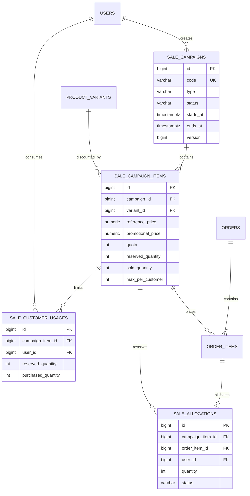
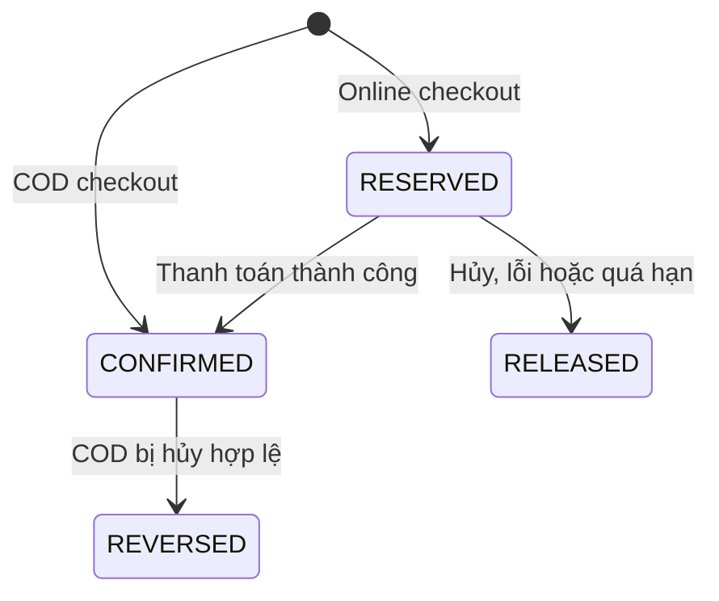

# Sale Campaign Backend

> Tài liệu học tập và vận hành cho tính năng Sale Campaign của VelaWear.
> Tài liệu này giải thích **vì sao** hệ thống được thiết kế như vậy, không chỉ liệt kê class hoặc endpoint.

---

## 1. Mục tiêu nghiệp vụ

Sale Campaign là nguồn duy nhất tạo ra giá khuyến mãi. `product_variants` chỉ lưu giá niêm yết (`price`), không còn lưu `sale_price`.

Hệ thống hỗ trợ hai loại chương trình:

| Loại | Ý nghĩa | Quota | Giới hạn mỗi khách | Coupon |
|------|---------|-------|--------------------|--------|
| `STANDARD` | Sale theo lịch như sale mùa hè, cuối tuần hoặc chiến dịch thương hiệu | Không | Không | Được xét theo điều kiện coupon |
| `FLASH` | Sale ngắn hạn, số lượng có hạn | Bắt buộc | Tùy chọn trên từng variant | Không tính dòng Flash vào subtotal đủ điều kiện |

Một campaign có thể chứa nhiều sản phẩm. Vì giá, tồn kho và quota thay đổi theo màu/size, quan hệ thực tế được lưu đến cấp `product_variants` thông qua `sale_campaign_items`.

Ví dụ: campaign "Flash Sale 20h" có thể chọn:

- Áo A: variant đen/M và đen/L.
- Giày B: variant trắng/40.
- Không bắt buộc chọn toàn bộ variant của một sản phẩm.

### 1.1 Quy tắc thời gian và trạng thái

Database chỉ lưu vòng đời do admin điều khiển:

- `DRAFT`: bản nháp, chưa xuất hiện ngoài storefront.
- `PUBLISHED`: đã công bố, được hệ thống xét theo thời gian.
- `CANCELLED`: đã hủy, không còn được áp dụng.

Các phase hiển thị không được lưu trong database mà được tính tại thời điểm đọc.
Phase có xét cả lifecycle status, vì campaign đã hủy phải biến mất khỏi nhóm
UPCOMING/LIVE ngay cả khi thời gian của nó chưa kết thúc:

```text
nếu status = CANCELLED: ENDED
ngược lại:
  UPCOMING = now < starts_at
  LIVE     = starts_at <= now < ends_at
  ENDED    = now >= ends_at
```

`phase` chỉ mô tả vị trí trên timeline. Muốn campaign có hiệu lực ngoài
storefront/pricing thì vẫn phải đồng thời có `status = PUBLISHED`.

Lý do không lưu `UPCOMING/LIVE/ENDED`: nếu lưu, hệ thống phải chạy job đúng từng giây để đổi trạng thái. Chỉ cần job trễ hoặc service tạm dừng thì dữ liệu sẽ sai. Tính phase từ đồng hồ database/application giúp kết quả luôn phản ánh đúng khoảng thời gian `[starts_at, ends_at)`.

### 1.2 Quy tắc chỉnh sửa

| Trạng thái/phase | Quyền chỉnh sửa |
|------------------|-----------------|
| `DRAFT` | Sửa/xóa tự do |
| `PUBLISHED + UPCOMING` | Sửa nội dung, thời gian, item; phải kiểm tra version và overlap lại |
| `PUBLISHED + LIVE` | Chỉ sửa nội dung hiển thị, tăng quota hoặc kết thúc sớm; không giảm quota/đổi giá/item |
| `ENDED` hoặc `CANCELLED` | Chỉ đọc để bảo toàn lịch sử |

`version` dùng optimistic locking. Nếu hai admin cùng mở một campaign, người lưu sau bằng version cũ nhận `CAMPAIGN_VERSION_CONFLICT` thay vì vô tình ghi đè thay đổi của người trước.

### 1.3 Quy tắc overlap và giá

- Không cho hai campaign **cùng loại** trùng thời gian trên cùng một variant.
- Một `STANDARD` và một `FLASH` được phép trùng nhau.
- Khi trùng, giá Flash phải thấp hơn giá Standard hiệu lực trong khoảng giao nhau.
- Thứ tự chọn giá: `FLASH` còn quota → `STANDARD` → giá niêm yết.
- Flash hết quota không làm variant biến mất: trang Flash hiển thị `SOLD_OUT`; catalog thông thường có thể quay về giá Standard hoặc giá niêm yết.

### 1.4 Nội dung song ngữ

`sale_campaigns` giữ lifecycle, thời gian, code, type, banner và text core để
tương thích. Tên/mô tả hiển thị theo ngôn ngữ nằm trong
`sale_campaign_translations`:

```text
sale_campaigns 1 --- N sale_campaign_translations N --- 1 locales
```

- `vi` là bản mặc định bắt buộc; `en` được bật.
- Public API resolve `?locale` trước, sau đó `Accept-Language`, cuối cùng `vi`.
- Nếu thiếu bản dịch yêu cầu, fallback `vi` rồi mới fallback text core.
- `banner_url` và campaign `code` dùng chung, không nhân đôi theo locale.
- Product name/slug trong Sale item phải resolve cùng locale với campaign để
  một response không trộn tiếng Việt và tiếng Anh.
- Admin dùng subresource `/api/v1/sale-campaigns/{id}/translations`; thao tác
  ghi/xóa mang optimistic `version` và không được xóa `vi`.

---

## 2. Mô hình dữ liệu

Chi tiết cột, constraint và index nằm trong [DATABASE.md](./DATABASE.md). Sơ đồ rút gọn:



### 2.1 Vai trò của từng bảng

`sale_campaigns`

- Lưu thông tin chung, loại, lifecycle và khung thời gian.
- `code` là định danh ổn định dùng trong URL/log; tên/banner có thể thay đổi.
- Không lưu phase dẫn xuất.

`sale_campaign_items`

- Mỗi dòng là một variant tham gia campaign.
- `reference_price` là snapshot giá tham chiếu lúc publish, phục vụ audit.
- `promotional_price` là giá áp dụng.
- Với Flash, ba counter `quota`, `reserved_quantity`, `sold_quantity` là nguồn sự thật trong PostgreSQL.

`sale_customer_usages`

- Theo dõi số lượng một khách đang giữ và đã mua trên từng campaign item.
- Unique `(campaign_item_id, user_id)` giúp mọi request cạnh tranh trên cùng một counter.
- Không dùng `SUM(order_items)` rồi mới insert, vì hai transaction có thể cùng đọc một tổng cũ.

`sale_allocations`

- Là sổ cái của mỗi lần một order item giữ/tiêu thụ quota Flash.
- Unique `order_item_id` ngăn cùng một dòng đơn tạo hai allocation.
- State transition có điều kiện giúp retry webhook/cancel không cộng hoặc trừ counter hai lần.

### 2.2 Snapshot trong đơn hàng

`order_items` phải giữ dữ liệu lịch sử, không tính lại từ catalog:

- `list_price`: giá niêm yết tại checkout.
- `price`: đơn giá thực trả trước coupon.
- `price_source`: `BASE`, `STANDARD_SALE` hoặc `FLASH_SALE`.
- `sale_campaign_item_id`: liên kết audit, nullable với dòng giá thường.
- Snapshot code/tên campaign để lịch sử không đổi khi admin sửa nội dung hiển thị.

`orders.resources_released_at` là dấu mốc idempotency cho việc hoàn stock, coupon và quota. `payment_due_at`/`reservation_expires_at` biểu diễn rõ hạn thanh toán và hạn giữ tài nguyên.

---

## 3. Pricing engine và coupon

Mọi API catalog, product detail, cart, checkout preview và checkout cuối cùng phải gọi cùng một pricing service. Không được tự viết lại công thức kiểu `salePrice != null ? salePrice : price` ở từng module.

### 3.1 Contract giá

```json
{
  "listPrice": 1500000,
  "effectivePrice": 990000,
  "priceSource": "FLASH_SALE",
  "campaignId": 12,
  "campaignItemId": 84,
  "campaignCode": "FLASH-2000",
  "campaignName": "Flash Sale 20h",
  "startsAt": "2026-07-15T13:00:00Z",
  "endsAt": "2026-07-15T15:00:00Z",
  "remainingQuota": 3,
  "maxPerCustomer": 2,
  "customerRemaining": 1,
  "couponEligible": false,
  "availableQuantity": 1
}
```

- `listPrice`: luôn lấy từ `product_variants.price`.
- `effectivePrice`: giá sẽ dùng nếu checkout ngay tại thời điểm response.
- Trường campaign/quota nullable khi nguồn giá là `BASE`.
- `customerRemaining` chỉ trả khi request đã xác thực; public API không được suy đoán user.
- `couponEligible` là `false` duy nhất với `FLASH_SALE`.
- `availableQuantity` là min của stock, Flash quota còn lại và lượt mua còn lại của khách (bỏ qua thành phần nullable).
- Response danh sách public `/sales` trả thêm `serverTime` để frontend tính countdown, tránh lệch đồng hồ thiết bị.

Giá hiển thị chỉ là thông tin tham khảo. Checkout luôn resolve lại giá trong transaction; client không được gửi `effectivePrice` làm nguồn sự thật.

### 3.2 Coupon trên mixed cart

Coupon là domain độc lập với campaign:

```text
eligibleSubtotal = tổng (price × quantity) của dòng BASE và STANDARD_SALE
flashSubtotal    = tổng (price × quantity) của dòng FLASH_SALE
couponDiscount   = tính theo eligibleSubtotal
orderSubtotal    = eligibleSubtotal + flashSubtotal
finalAmount      = orderSubtotal + shippingFee - couponDiscount
```

Nếu `eligibleSubtotal = 0`, coupon không được tiêu thụ. Việc coupon hợp lệ cho sản phẩm/category nào vẫn tuân theo rule riêng của coupon; Sale Campaign chỉ loại dòng Flash khỏi tập đủ điều kiện.

---

## 4. Checkout và chống race condition

### 4.1 Vì sao kiểm tra rồi ghi là chưa đủ

Giả sử quota còn 1, hai request đồng thời cùng chạy:

1. Request A đọc `remaining = 1`.
2. Request B cũng đọc `remaining = 1` trước khi A commit.
3. Cả hai cùng trừ 1.

Nếu chỉ kiểm tra bằng Java rồi `save()`, hệ thống đã bán 2 suất dù quota chỉ còn 1. Vì vậy điều kiện và cập nhật phải nằm trong **cùng một câu lệnh atomic** hoặc được bảo vệ bằng row lock.

Ví dụ ý tưởng cho quota:

```sql
UPDATE sale_campaign_items
SET reserved_quantity = reserved_quantity + :quantity
WHERE id = :itemId
  AND reserved_quantity + sold_quantity + :quantity <= quota;
```

`affectedRows = 0` nghĩa là quota vừa hết hoặc dữ liệu không còn hợp lệ. Backend trả conflict, không cố đoán lại từ dữ liệu cache.

Giới hạn khách cũng được reserve bằng upsert/conditional update trên `sale_customer_usages`, với invariant:

```text
reserved_quantity + purchased_quantity + requested_quantity <= max_per_customer
```

### 4.2 Transaction checkout

Một checkout chạy trong một `@Transactional` duy nhất:

1. Khóa cart của user để tuần tự hóa hai lần checkout cùng tài khoản.
2. Kiểm tra `Idempotency-Key`.
3. Đọc cart từ database, không nhận danh sách item/giá từ client.
4. Resolve pricing và bắt buộc so sánh `pricingFingerprint` từ preview.
5. Khóa/recheck campaign Standard liên quan rồi tạo order trong transaction.
6. Sắp xếp dòng theo variant ID; với mỗi dòng Flash, bảo đảm row
   `sale_customer_usages` đã tồn tại (`createCounterIfAbsent`).
7. Reserve Flash quota bằng atomic update.
8. Reserve customer usage bằng conditional update trên row vừa bảo đảm tồn tại.
9. Trừ stock bằng atomic conditional update.
10. Consume coupon theo eligible subtotal bằng atomic update.
11. Tạo order item snapshot, payment, allocation; xóa cart rồi commit.

Thứ tự cạnh tranh quan trọng là **tạo usage counter → quota → customer usage →
stock**. Nếu bước 9 phát hiện stock chỉ còn 1 trong khi khách mua 2, transaction
ném exception. Toàn bộ thay đổi ở bước 6-8 cũng rollback; đây là ý nghĩa của
"giữ được quota nhưng hết stock thì rollback quota". Backend đồng thời trả lỗi
rõ ràng để UI refresh giỏ hàng, không bắt người dùng tự reload trang.

Fingerprint bao gồm item, số lượng, nguồn giá/campaign, coupon snapshot, eligible subtotal, discount, shipping và final amount. Vì vậy admin đổi quyền lợi coupon sau preview cũng tạo `PRICE_CHANGED`, không âm thầm chốt tổng tiền khác.

### 4.3 Idempotency checkout

Client tạo một key mới cho **mỗi ý định đặt đơn** và bắt buộc gửi:

```http
Idempotency-Key: 43b34a30-444a-4bb7-9845-8ca560f67df0
```

Backend lưu `(user_id, checkout_idempotency_key, checkout_request_hash)`:

- Cùng key + cùng payload: trả lại order đã tạo, không trừ tài nguyên lần hai.
- Cùng key + payload khác: trả `IDEMPOTENCY_KEY_REUSED`.
- Người dùng bấm nút hai lần hoặc retry do mất mạng không tạo hai đơn.
- Replay SePay chỉ phát lại form trước `payment_due_at`; nếu đã qua
  `reservation_expires_at`, backend release đúng một lần và không phát form mới.

### 4.4 Allocation state machine



Ý nghĩa:

- `RESERVED`: quota/usage đang được giữ cho đơn chuyển khoản, chưa tính là đã bán.
- `CONFIRMED`: thanh toán thành công hoặc COD đã tạo; chuyển counter từ reserved sang sold/purchased.
- `RELEASED`: chưa hoàn tất mua, trả phần giữ về quota/usage.
- `REVERSED`: giao dịch từng được xác nhận nhưng sau đó hủy hợp lệ; đảo sold/purchased.

Transition phải là compare-and-set, ví dụ chỉ `RESERVED -> CONFIRMED`. Webhook lặp lại gặp status `CONFIRMED` sẽ không tăng `sold_quantity` lần hai.

### 4.5 Payment, timeout và IPN đến muộn

- Thanh toán online có `payment_due_at = created_at + 15 phút`.
- Hệ thống chờ thêm 30 giây để webhook đang trên đường được xử lý.
- Scheduler chỉ release sau `reservation_expires_at = payment_due_at + 30 giây`.
- IPN và scheduler đều khóa order/payment cần xử lý, sau đó kiểm tra state trong database.
- Nếu IPN thắng: allocation được confirm, scheduler bỏ qua.
- Nếu scheduler thắng: tài nguyên được release; tiền đến sau được đánh dấu `REFUND_PENDING`, không tự hồi sinh đơn đã hết hạn.
- Nếu gateway báo thêm transaction khác cho đơn đã thanh toán, transaction mới được lưu với `REFUND_PENDING`; allocation không confirm lần hai và mã transaction gốc không bị ghi đè.
- Reservation tạo hợp lệ trước lúc campaign kết thúc vẫn được thanh toán đến `reservation_expires_at`.
- Kết thúc campaign sớm chỉ chặn checkout mới, không hủy reservation đang hợp lệ.

`resources_released_at` và conditional transition bảo đảm stock, coupon, quota và customer usage chỉ được hoàn đúng một lần, kể cả khi cancel, payment failure và scheduler chạy gần nhau.

### 4.6 PostgreSQL và Redis

PostgreSQL là nguồn sự thật của stock/quota/usage/allocation. Redis chỉ được dùng cho cache, rate limit hoặc giảm tải đọc. Không dùng Redis counter làm quota chính nếu chưa có cơ chế đồng bộ và phục hồi nhất quán.

---

## 5. API

### 5.1 Admin campaign

| Method | Endpoint | Mục đích |
|--------|----------|----------|
| `GET` | `/api/v1/sale-campaigns` | Danh sách/filter campaign |
| `GET` | `/api/v1/sale-campaigns/{id}` | Chi tiết campaign và items |
| `POST` | `/api/v1/sale-campaigns` | Tạo DRAFT |
| `PUT` | `/api/v1/sale-campaigns/{id}` | Sửa với optimistic `version` |
| `DELETE` | `/api/v1/sale-campaigns/{id}` | Xóa DRAFT |
| `POST` | `/api/v1/sale-campaigns/{id}/publish` | Validate rồi publish |
| `POST` | `/api/v1/sale-campaigns/{id}/cancel` | Hủy campaign UPCOMING |
| `PATCH` | `/api/v1/sale-campaigns/{id}/display` | Sửa trường hiển thị khi LIVE |
| `POST` | `/api/v1/sale-campaigns/{id}/items/{itemId}/increase-quota` | Chỉ tăng quota Flash |
| `POST` | `/api/v1/sale-campaigns/{id}/end` | Kết thúc sớm |
| `POST` | `/api/v1/sale-campaigns/{id}/end-and-clone` | Kết thúc và tạo DRAFT kế nhiệm |

`publish`, `cancel`, `end` truyền `version` bằng query parameter; các action có
payload còn lại truyền `version` trong JSON body.

### 5.2 Storefront và checkout

| Method | Endpoint | Mục đích |
|--------|----------|----------|
| `GET` | `/api/v1/sales?type=STANDARD` | Standard đã publish và chưa kết thúc |
| `GET` | `/api/v1/sales?type=FLASH` | Flash live/upcoming |
| `GET` | `/api/v1/sales/{code}` | Chi tiết public theo code |
| `POST` | `/api/v1/checkout/preview` | Server tính lại giá, coupon, shipping và fingerprint |
| `POST` | `/api/v1/checkout` | Đặt đơn với `Idempotency-Key` và fingerprint |
| `POST` | `/api/v1/checkout/{orderId}/cancel` | Hủy hợp lệ và release/reverse tài nguyên |

Public Sale GET không cần JWT. `type` là optional; bỏ trống để lấy cả hai loại.
Nếu có JWT hợp lệ, pricing response có thể bổ sung `customerRemaining`.
Mỗi public campaign item có sẵn `productId`, `productName`, `productSlug`,
`image`, `sku`, `color`, `size` để UI dựng card mà không cần N+1 request.

### 5.3 Error contract

```json
{
  "statusCode": 409,
  "code": "FLASH_SALE_LIMIT_EXCEEDED",
  "data": {
    "variantId": 41,
    "requestedQuantity": 2,
    "customerRemaining": 1
  },
  "message": "Bạn chỉ còn có thể mua 1 sản phẩm trong chương trình Flash Sale này",
  "timestamp": "2026-07-15T13:20:10Z"
}
```

| Code | HTTP | Khi nào xảy ra |
|------|------|----------------|
| `INSUFFICIENT_STOCK` | 409 | Stock thực tế nhỏ hơn số lượng checkout |
| `FLASH_SALE_SOLD_OUT` | 409 | Flash quota không còn đủ |
| `FLASH_SALE_ENDED` | 409 | Campaign đã hết/kết thúc trước lúc checkout |
| `FLASH_SALE_LIMIT_EXCEEDED` | 409 | Vượt giới hạn cộng dồn của khách |
| `PRICE_CHANGED` | 409 | Fingerprint/giá preview không còn hiện hành |
| `CAMPAIGN_OVERLAP` | 409 | Variant trùng campaign cùng loại |
| `CAMPAIGN_VERSION_CONFLICT` | 409 | Admin lưu bằng optimistic version cũ |
| `CAMPAIGN_ALREADY_STARTED` | 409 | Thao tác không được phép sau khi bắt đầu |
| `CAMPAIGN_NOT_LIVE` | 409 | Action live-only gọi khi campaign chưa/không còn live |
| `INVALID_FLASH_PRICE` | 409 | Flash price không thấp hơn Standard đang overlap |
| `IDEMPOTENCY_KEY_REUSED` | 409 | Cùng key nhưng request hash khác |
| `COUPON_INVALID` | 400 | Coupon không tồn tại, hết hạn hoặc không thỏa điều kiện |
| `IDEMPOTENCY_KEY_INVALID` | 400 | Header idempotency rỗng hoặc dài quá 100 ký tự |
| `MISSING_REQUEST_HEADER` | 400 | Thiếu header bắt buộc, ví dụ `Idempotency-Key` |

UI phải dựa vào `code`, không phân tích chuỗi `message`. `data` chứa ngữ cảnh an toàn để chỉ đúng dòng lỗi; không trả stack trace hoặc dữ liệu nội bộ.

---

## 6. Kiểm thử bắt buộc

Các test cạnh tranh phải chạy bằng Testcontainers PostgreSQL. H2 hoặc mock repository không chứng minh được hành vi row lock/atomic update thật.

| Nhóm | Kịch bản | Kết quả cần chứng minh |
|------|----------|------------------------|
| Pricing | Flash + Standard cùng variant | Flash thắng khi live/còn quota; fallback đúng khi sold out |
| Time | Đúng tại `starts_at` và `ends_at` | Khoảng áp dụng là `[start, end)` |
| Publish | Hai admin publish campaign xung đột | Chỉ một transaction thành công |
| Quota | Quota 1, hai khách checkout đồng thời | Đúng một order thành công |
| Customer limit | Một khách checkout đồng thời ở hai request | Tổng không vượt `max_per_customer` |
| Rollback | Reserve quota xong nhưng stock thiếu | Quota và usage không đổi sau rollback |
| Coupon | Cart BASE + STANDARD + FLASH | Chỉ BASE/STANDARD nằm trong eligible subtotal |
| Checkout idempotency | Retry cùng key/payload | Cùng order, tài nguyên chỉ trừ một lần |
| Checkout idempotency | Cùng key, payload khác | `IDEMPOTENCY_KEY_REUSED` |
| Cancel | Hai request cancel đồng thời | Tài nguyên chỉ hoàn một lần |
| IPN | Webhook cùng transaction code gửi lặp | Allocation chỉ confirm một lần |
| Race timeout | IPN và scheduler chạy đồng thời | Chỉ một state transition thắng |
| COD | Hủy COD đã confirm | Allocation `REVERSED`, counter/stock đảo đúng một lần |
| Deadlock | Cart nhiều variant theo thứ tự khác nhau | Service khóa theo ID cố định, không deadlock |
| i18n | Sale public `locale=en` | Campaign và Product item cùng trả EN; thiếu EN fallback VI |
| Admin i18n | Hai Admin cập nhật translation cùng version | Chỉ request đầu thành công, request sau conflict |
| Seed | Chạy lại `R__5`/`R__6` | Không tăng translation, campaign hoặc item |

### 6.1 Checklist khi điều tra lỗi

1. Kiểm tra `sale_allocations.status` của order item.
2. Đối chiếu `reserved_quantity + sold_quantity <= quota`.
3. Đối chiếu customer usage với tổng allocation chưa release/reverse.
4. Kiểm tra `orders.resources_released_at` trước khi chạy hoàn tài nguyên thủ công.
5. Kiểm tra payment transaction/IPN đã được deduplicate theo transaction code chưa.
6. Không sửa counter trực tiếp nếu chưa hiểu allocation nào tạo ra chênh lệch.

---

## 7. Các invariant cần luôn đúng

```text
sale campaign item STANDARD:
  quota = null
  max_per_customer = null
  reserved_quantity = 0
  sold_quantity = 0

sale campaign item FLASH:
  quota > 0
  reserved_quantity >= 0
  sold_quantity >= 0
  reserved_quantity + sold_quantity <= quota

customer usage:
  reserved_quantity >= 0
  purchased_quantity >= 0
  nếu có max_per_customer:
    reserved_quantity + purchased_quantity <= max_per_customer

order item:
  price <= list_price
  subtotal = price * quantity
  price_source = BASE       => sale_campaign_item_id IS NULL
  price_source thuộc SALE   => sale_campaign_item_id IS NOT NULL
```

Nếu một thay đổi mới phá các invariant này hoặc đưa một nguồn giá khác ngoài pricing engine, cần xem lại thiết kế trước khi merge.
