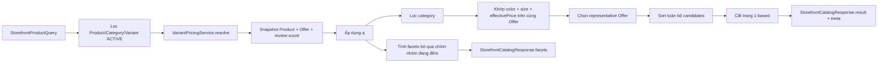
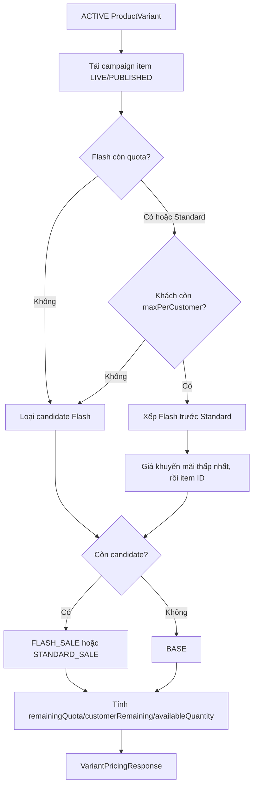
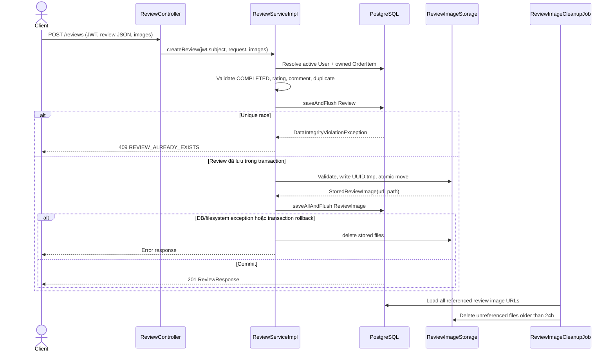

# Storefront Catalog UX — Backend

> Ngày cập nhật: **2026-07-16**<br>
> OpenSpec change ID: **`complete-storefront-catalog-ux`**<br>
> Tài liệu companion phía Frontend: [STOREFRONT_CATALOG_UX_FRONTEND_VI.md](../../commercial-fe-storefront-catalog-ux/docs/STOREFRONT_CATALOG_UX_FRONTEND_VI.md)

Tài liệu này mô tả contract và hành vi đã có trong code Backend cho catalog storefront, giá hiệu lực và review đã xác minh. Tên class, field, endpoint và đoạn mã được giữ bằng tiếng Anh; phần giải thích dùng tiếng Việt để thuận tiện bàn giao.

## Mục lục

1. [Mục tiêu và phạm vi](#1-mục-tiêu-và-phạm-vi)
2. [Tổng quan API](#2-tổng-quan-api)
3. [Storefront Catalog](#3-storefront-catalog)
4. [Giá hiệu lực, sắp xếp và phân trang](#4-giá-hiệu-lực-sắp-xếp-và-phân-trang)
5. [Review công khai và review của khách hàng](#5-review-công-khai-và-review-của-khách-hàng)
6. [Upload ảnh review, rollback và cleanup](#6-upload-ảnh-review-rollback-và-cleanup)
7. [Bảo mật, riêng tư và mã lỗi](#7-bảo-mật-riêng-tư-và-mã-lỗi)
8. [Hiệu năng và khả năng mở rộng](#8-hiệu-năng-và-khả-năng-mở-rộng)
9. [Kiểm thử và đối chiếu contract](#9-kiểm-thử-và-đối-chiếu-contract)
10. [Triển khai, rollback và troubleshooting](#10-triển-khai-rollback-và-troubleshooting)
11. [Nếu cần sửa sau này](#11-nếu-cần-sửa-sau-này)

## 1. Mục tiêu và phạm vi

Backend cung cấp một nguồn dữ liệu thống nhất cho Collection, Search và gợi ý tìm kiếm của storefront, đồng thời bổ sung luồng review an toàn cho khách hàng đã mua hàng.

Các quyết định đã khóa:

- Giữ nguyên `GET /api/v1/products` và các API quản trị cũ; storefront dùng endpoint mới riêng.
- Chỉ Product, Category và Product Variant có `status = ACTIVE`, `deletedAt = null` mới đi vào catalog công khai.
- Màu, size và giá phải khớp trên **cùng một Product Variant**.
- OR trong cùng nhóm facet; AND giữa category, color, size và price.
- Giá lọc, giá hiển thị và thứ tự giá đều lấy từ `VariantPricingService`.
- Review công khai không lộ `userId`, `orderId`, `orderCode` hay `orderItemId`.
- Khách hàng chỉ tạo review cho `OrderItem` của chính mình khi Order có `status = COMPLETED`; mỗi cặp user/order item chỉ có một review.
- Review được đăng ngay. Edit, delete và moderation không thuộc change này.
- Không có migration mới; unique constraint `uq_reviews_user_order_item` và bảng `review_images` hiện có được tái sử dụng.

## 2. Tổng quan API

Base URL khi chạy local là `http://localhost:8080/api/v1`. Mọi response dùng wrapper `ApiResponse<T>`:

```json
{
  "statusCode": 200,
  "data": {},
  "message": "Success",
  "timestamp": "2026-07-16T14:30:00"
}
```

| Method | Endpoint | Auth | Mục đích |
|---|---|---|---|
| `GET` | `/api/v1/storefront/products` | Public, JWT tùy chọn | Search, filter, sort, phân trang và facets |
| `GET` | `/api/v1/reviews/product/{productId}` | Public | Danh sách review công khai |
| `GET` | `/api/v1/reviews/product/{productId}/summary` | Public | Tổng số, trung bình và phân bố sao |
| `GET` | `/api/v1/reviews/me` | Bearer JWT | Review của principal hiện tại, có thể lọc theo `orderId` |
| `POST` | `/api/v1/reviews` | Bearer JWT | Tạo review multipart cùng tối đa 5 ảnh |

Các endpoint review quản trị cũ như `/reviews`, `/reviews/user/{userId}`, `/reviews/order/{orderId}` và `/reviews/order-item/{orderItemId}` vẫn được giữ và tiếp tục đi qua RBAC.

## 3. Storefront Catalog

### 3.1 Contract request

`GET /api/v1/storefront/products`

| Query param | Kiểu | Mặc định/giới hạn | Ý nghĩa |
|---|---|---|---|
| `q` | `String` | tối đa 120 ký tự | Tìm không phân biệt hoa thường trong tên, slug, mô tả ngắn/dài, material và tên category |
| `categorySlugs` | `List<String>` | mỗi slug tối đa 180 ký tự | Chọn nhiều category theo slug |
| `colorIds` | `List<Long>` | ID dương | Chọn nhiều màu |
| `sizeIds` | `List<Long>` | ID dương | Chọn nhiều size |
| `minPrice` | `BigDecimal` | `>= 0` | Cận dưới giá hiệu lực, inclusive |
| `maxPrice` | `BigDecimal` | `>= 0` | Cận trên giá hiệu lực, inclusive |
| `sort` | `String` | `featured` | `featured`, `newest`, `price-asc`, `price-desc` |
| `page` | `Integer` | `1`, nhỏ nhất 1 | Số trang public 1-based |
| `size` | `Integer` | `12`, từ 1 đến 60 | Số sản phẩm mỗi trang |
| `locale` | `String` | resolve từ header hoặc `vi` | Locale nội dung, tối đa 35 ký tự |

Spring hỗ trợ CSV cho list param. Ví dụ đầy đủ:

```http
GET /api/v1/storefront/products?q=linen&categorySlugs=ao,ao-khoac&colorIds=1,2&sizeIds=3,4&minPrice=300000&maxPrice=1800000&sort=price-asc&page=1&size=12&locale=vi
Accept-Language: vi
```

Cũng có thể lặp query param khi client serializer dùng dạng array:

```http
GET /api/v1/storefront/products?categorySlugs=ao&categorySlugs=ao-khoac&colorIds=1&colorIds=2
```

Lưu ý: URL giao diện có thể dùng tên ngắn như `categories`, `colors`, `sizes`; Frontend phải chuyển chúng sang đúng contract Backend là `categorySlugs`, `colorIds`, `sizeIds`.

### 3.2 Contract response

`data` là `StorefrontCatalogResponse`, gồm `result`, `meta` và `facets`:

```json
{
  "statusCode": 200,
  "data": {
    "result": [
      {
        "id": 42,
        "categoryId": 6,
        "brandId": 1,
        "name": "Áo sơ mi Linen",
        "slug": "ao-so-mi-linen",
        "originalSlug": "ao-so-mi-linen",
        "status": "ACTIVE",
        "thumbnail": "/uploads/products/ao-so-mi-linen.jpg",
        "images": ["/uploads/products/ao-so-mi-linen.jpg"],
        "categoryName": "Áo",
        "categorySlug": "ao",
        "price": 890000,
        "pricing": {
          "listPrice": 1090000,
          "effectivePrice": 890000,
          "priceSource": "STANDARD_SALE",
          "campaignId": 7,
          "campaignItemId": 31,
          "campaignCode": "LINEN-SUMMER",
          "campaignName": "Ưu đãi Linen",
          "startsAt": "2026-07-01T00:00:00Z",
          "endsAt": "2026-07-31T00:00:00Z",
          "remainingQuota": null,
          "maxPerCustomer": null,
          "customerRemaining": null,
          "couponEligible": true,
          "availableQuantity": 18
        },
        "translationLocales": ["en", "vi"]
      }
    ],
    "meta": {
      "page": 1,
      "pageSize": 12,
      "pages": 4,
      "total": 43
    },
    "facets": {
      "categories": [
        {"id": 6, "name": "Áo", "slug": "ao", "count": 21}
      ],
      "colors": [
        {"id": 1, "name": "Đen", "hexCode": "#000000", "sortOrder": 1, "count": 18}
      ],
      "sizes": [
        {"id": 3, "name": "M", "sortOrder": 3, "count": 15}
      ],
      "priceRange": {"min": 290000, "max": 2490000}
    }
  },
  "message": "Success",
  "timestamp": "2026-07-16T14:30:00"
}
```

Ví dụ trên chỉ rút gọn các field mô tả và gallery của `ProductResponse`; client phải bỏ qua field chưa biết để tương thích khi DTO mở rộng.

### 3.3 Quy tắc OR/AND và “cùng variant”

Với request:

```text
categorySlugs = {ao, ao-khoac}
colorIds      = {1, 2}
sizeIds       = {3, 4}
price         = [300000, 1800000]
```

Một Product khớp khi:

```text
(category là ao OR ao-khoac)
AND tồn tại một ACTIVE variant chưa xóa thỏa:
    (color = 1 OR 2)
    AND (size = 3 OR 4)
    AND effectivePrice trong [300000, 1800000]
```

Không được ghép màu từ variant A với size từ variant B. `StorefrontCatalogFilterEngine.matchingOffers(...)` áp dụng color, size và price trên từng `Offer` nên bảo đảm điều kiện này.

### 3.4 Facet count

Facet count là số **Product khác nhau**, không phải số Variant:

- Category facet bỏ qua lựa chọn category hiện tại nhưng vẫn áp dụng search, color, size và price.
- Color facet bỏ qua lựa chọn color hiện tại nhưng vẫn áp dụng search, category, size và price.
- Size facet bỏ qua lựa chọn size hiện tại nhưng vẫn áp dụng search, category, color và price.
- `priceRange` bỏ qua min/max hiện tại nhưng vẫn áp dụng search, category, color và size.
- Option đã biết vẫn xuất hiện với `count = 0`; Frontend có thể disable/mờ nhưng không nên tự xóa khỏi state URL.



## 4. Giá hiệu lực, sắp xếp và phân trang

### 4.1 `VariantPricingService`

Mỗi ACTIVE variant được resolve đúng một `VariantPricing` tại thời điểm request:

1. Tải các Sale Campaign Item đang active cho variant.
2. Bỏ Flash Sale hết quota.
3. Với người đã đăng nhập, bỏ Flash Sale đã hết `maxPerCustomer` theo tổng reserved + purchased.
4. Ưu tiên Flash Sale trước Standard Sale; trong cùng loại chọn `promotionalPrice` thấp nhất rồi ID nhỏ nhất.
5. Nếu không có campaign phù hợp, dùng `BASE` với `effectivePrice = ProductVariant.price`.
6. `availableQuantity` là min của tồn kho, quota còn lại và quota khách hàng còn lại khi các giới hạn tồn tại.

JWT là tùy chọn ở catalog. Nếu request có principal hợp lệ, pricing và `customerRemaining` được cá nhân hóa; anonymous dùng ngữ cảnh không có usage của khách hàng.



### 4.2 Giá đại diện của Product

Sau khi áp dụng filter trên variant, Product chọn Offer có `effectivePrice` thấp nhất; nếu bằng giá thì variant ID nhỏ hơn thắng. `ProductResponse.price` bằng `pricing.listPrice` của Offer đại diện, còn giá khách thực trả nằm ở `pricing.effectivePrice`.

Do đó Frontend phải hiển thị, lọc và so sánh theo `pricing.effectivePrice`, không tự suy ra từ `price` hoặc field sale cũ.

### 4.3 Bốn kiểu sort

| `sort` | Thứ tự |
|---|---|
| `featured` | Sale priority (Flash > Standard > Base), % giảm lớn hơn, average rating, review count, mới hơn, Product ID lớn hơn |
| `newest` | `createdAt` mới hơn, rồi Product ID lớn hơn |
| `price-asc` | `effectivePrice` của Offer đại diện tăng dần, rồi Product ID lớn hơn |
| `price-desc` | `effectivePrice` của Offer đại diện giảm dần, rồi Product ID lớn hơn |

Sale priority và % giảm dùng giá trị tốt nhất trong các Offer còn khớp của Product. Review score được tổng hợp theo Product qua các review gắn với variant của Product đó.

Không gửi `sort=price` hoặc tên property JPA vào endpoint storefront. `StorefrontProductSort` là whitelist độc lập và giá trị ngoài bốn lựa chọn trả `400`.

### 4.4 Phân trang

- Request `page` là 1-based; mặc định 1.
- `size` mặc định 12, tối đa 60.
- Hệ thống sort toàn bộ candidate trước rồi mới cắt trang.
- Khi `page` vượt cuối, `result` rỗng nhưng `meta.page` vẫn phản ánh page đã yêu cầu.
- Khi không có dữ liệu, `pages = 0`, `total = 0`.

## 5. Review công khai và review của khách hàng

### 5.1 Danh sách review công khai

```http
GET /api/v1/reviews/product/42?rating=5&sort=newest&page=1&size=10
```

| Param | Giá trị |
|---|---|
| `rating` | tùy chọn, từ 1 đến 5 |
| `sort` | `newest`, `oldest`, `rating-high`, `rating-low`; mặc định `newest` |
| `page` | 1-based do Spring cấu hình |
| `size` | mặc định 10; service từ chối giá trị lớn hơn 100 |

Response dùng `ResultPaginationDTO` và `PublicReviewResponse`:

```json
{
  "statusCode": 200,
  "data": {
    "meta": {"page": 1, "pageSize": 10, "pages": 3, "total": 27},
    "result": [
      {
        "id": 501,
        "userName": "Nguyễn An",
        "productId": 42,
        "productName": "Áo sơ mi Linen",
        "productSlug": "ao-so-mi-linen",
        "variantName": "Đen / M",
        "rating": 5,
        "comment": "Chất vải thoáng và form vừa người.",
        "images": ["/uploads/reviews/4c50c06b-4c70-4721-a2d0-65d96a0f2768.webp"],
        "verifiedPurchase": true,
        "createdAt": "2026-07-16T07:20:00Z"
      }
    ]
  },
  "message": "Success",
  "timestamp": "2026-07-16T14:30:00"
}
```

API công khai cố ý không trả `userId`, `orderId`, `orderCode` hoặc `orderItemId`.

### 5.2 Summary

```http
GET /api/v1/reviews/product/42/summary
```

```json
{
  "statusCode": 200,
  "data": {
    "total": 27,
    "averageRating": 4.4,
    "ratingCounts": {"1": 1, "2": 0, "3": 3, "4": 7, "5": 16}
  },
  "message": "Success",
  "timestamp": "2026-07-16T14:30:00"
}
```

`ratingCounts` luôn đủ key 1 đến 5. Average được làm tròn một chữ số thập phân; sản phẩm chưa có review trả total/average bằng 0 và mọi count bằng 0.

### 5.3 Review của principal hiện tại

```http
GET /api/v1/reviews/me?orderId=88&page=1&size=100
Authorization: Bearer <access-token>
```

Backend lấy email từ JWT subject, resolve User active rồi ép filter theo chính `userId` đó. Client không thể đổi user qua query param. `orderId` là tùy chọn và dùng để kiểm tra item nào của chi tiết đơn đã được review.

Response dùng `ReviewResponse` giàu thông tin (`userId`, `orderId`, `orderCode`, `orderItemId`) vì đây là dữ liệu riêng của principal đã xác thực.

```json
{
  "statusCode": 200,
  "data": {
    "meta": {"page": 1, "pageSize": 100, "pages": 1, "total": 1},
    "result": [
      {
        "id": 501,
        "userId": 25,
        "userName": "Nguyễn An",
        "orderId": 88,
        "orderCode": "VELA-A1B2C3D4",
        "orderItemId": 101,
        "productName": "Áo sơ mi Linen",
        "productId": 42,
        "productSlug": "ao-so-mi-linen",
        "variantName": "Đen / M",
        "rating": 5,
        "comment": "Rất vừa vặn",
        "images": ["/uploads/reviews/4c50c06b-4c70-4721-a2d0-65d96a0f2768.webp"],
        "createdAt": "2026-07-16T07:20:00Z"
      }
    ]
  },
  "message": "Success",
  "timestamp": "2026-07-16T14:30:00"
}
```

### 5.4 Tạo review multipart

```http
POST /api/v1/reviews
Authorization: Bearer <access-token>
Content-Type: multipart/form-data
```

Hai part:

| Part | Content type | Bắt buộc | Nội dung |
|---|---|---|---|
| `review` | `application/json` | Có | `{"orderItemId":101,"rating":5,"comment":"Rất vừa vặn"}` |
| `images` | `image/jpeg`, `image/png` hoặc `image/webp` | Không | Lặp tối đa 5 part ảnh |

Ví dụ cURL:

```bash
curl -X POST "http://localhost:8080/api/v1/reviews" \
  -H "Authorization: Bearer $ACCESS_TOKEN" \
  -F 'review={"orderItemId":101,"rating":5,"comment":"Rất vừa vặn"};type=application/json' \
  -F "images=@front.webp;type=image/webp" \
  -F "images=@detail.jpg;type=image/jpeg"
```

Response `201 Created` dùng `ReviewResponse` của principal. Điều kiện nghiệp vụ:

- `orderItemId` bắt buộc.
- `rating` bắt buộc, nguyên từ 1 đến 5.
- `comment` tùy chọn, tối đa 1.000 ký tự; blank được lưu thành null, nội dung khác được trim.
- OrderItem phải tồn tại và thuộc User hiện tại; trường hợp không thuộc chủ đơn cũng trả 404 để không làm lộ ID.
- Order phải có `status = COMPLETED`.
- Mỗi User/OrderItem chỉ có một review. Service kiểm tra sớm và unique constraint chặn race ở database.
- JSON không nhận `userId`, URL ảnh hay tên file lưu trữ. Tên file multipart chỉ dùng kiểm tra extension/MIME/signature; file đích luôn là UUID do server tạo.

Response thành công:

```json
{
  "statusCode": 201,
  "data": {
    "id": 501,
    "userId": 25,
    "userName": "Nguyễn An",
    "orderId": 88,
    "orderCode": "VELA-A1B2C3D4",
    "orderItemId": 101,
    "productName": "Áo sơ mi Linen",
    "productId": 42,
    "productSlug": "ao-so-mi-linen",
    "variantName": "Đen / M",
    "rating": 5,
    "comment": "Rất vừa vặn",
    "images": ["/uploads/reviews/4c50c06b-4c70-4721-a2d0-65d96a0f2768.webp"],
    "createdAt": "2026-07-16T07:20:00Z"
  },
  "message": "Created",
  "timestamp": "2026-07-16T14:30:00"
}
```

## 6. Upload ảnh review, rollback và cleanup

### 6.1 Validation và lưu file

- Tối đa 5 ảnh/review.
- Tối đa 5 MB/ảnh qua `app.upload.max-size-bytes = 5242880`.
- Tổng request mặc định tối đa 26 MB qua `spring.servlet.multipart.max-request-size`.
- Extension được chấp nhận: JPG/JPEG, PNG, WebP và phải đồng thời nằm trong `app.upload.allowed-extensions`.
- MIME phải khớp extension; magic signature của file cũng được kiểm tra.
- File nằm trong `<app.upload.base-dir>/reviews` và URL có dạng `<app.upload.url-prefix>/reviews/<uuid>.<ext>`.
- Dữ liệu được copy vào `<uuid>.tmp`, sau đó `Files.move(..., ATOMIC_MOVE)` sang tên đích.
- `POST /api/v1/files` từ chối `folder=reviews`; ảnh review chỉ được đi qua `POST /api/v1/reviews`.

### 6.2 Transaction, rollback và cleanup



`registerRollbackCleanup(...)` đăng ký `TransactionSynchronization`; nếu transaction không commit, các file vừa ghi được xóa. Nếu xóa tức thời thất bại, job orphan sẽ thử lại sau.

`ReviewImageCleanupJob` chạy theo cron `${app.review.image-cleanup-cron:0 30 2 * * *}`; mặc định 02:30 mỗi ngày theo timezone JVM. Job chỉ xóa file thỏa cả hai điều kiện:

1. `lastModified` cũ hơn 24 giờ;
2. URL không còn xuất hiện trong `review_images.image`.

Ví dụ override khi triển khai:

```yaml
spring:
  servlet:
    multipart:
      max-file-size: 5MB
      max-request-size: 26MB

app:
  upload:
    base-dir: /var/lib/velawear/uploads
    url-prefix: /uploads
    max-size-bytes: 5242880
    allowed-extensions: [jpg, jpeg, png, webp]
    allowed-folders: [avatars, products]
  review:
    image-cleanup-cron: "0 30 2 * * *"
```

Không cần thêm `reviews` vào `allowed-folders`; folder này được `ReviewImageStorage` quản lý riêng.

## 7. Bảo mật, riêng tư và mã lỗi

### 7.1 Ma trận quyền

| API | Anonymous | Authenticated USER | Admin/RBAC |
|---|---:|---:|---:|
| `GET /storefront/products` | Có | Có, pricing có thể cá nhân hóa quota | Có |
| `GET /reviews/product/**` | Có | Có | Có |
| `GET /reviews/me` | 401 | Chỉ dữ liệu principal | Có, vẫn scope principal |
| `POST /reviews` | 401 | Có nếu đủ điều kiện đơn hàng | Có nếu đủ điều kiện đơn hàng |
| Review admin endpoints cũ | 401 | Thường 403 nếu thiếu permission | Theo `PermissionAuthorizationManager` |

### 7.2 Mã lỗi quan trọng

| HTTP | `code`/message tiêu biểu | Nguyên nhân |
|---:|---|---|
| 400 | `Validation failed` | Query catalog sai, page/size sai, minPrice > maxPrice, rating/comment sai |
| 400 | `Invalid public review sort` | Sort review không thuộc whitelist |
| 400 | `Review image ...` | Quá 5 ảnh, ảnh rỗng, sai extension/MIME/signature, tên multipart nguy hiểm |
| 401 | Security entry point | Thiếu/hỏng/blacklisted JWT ở `/reviews/me` hoặc `POST /reviews` |
| 403 | Access denied | Gọi endpoint review quản trị nhưng thiếu permission |
| 404 | `OrderItem ... not found` | ID không tồn tại hoặc OrderItem thuộc user khác |
| 409 | `REVIEW_ORDER_NOT_COMPLETED` | Order chưa `COMPLETED` |
| 409 | `REVIEW_ALREADY_EXISTS` | Đã review hoặc hai request trùng race tại unique constraint |
| 413 | `Uploaded file exceeds maximum allowed size` | Vượt giới hạn multipart của Servlet |
| 500 | `Internal server error` | I/O hoặc lỗi không dự kiến; chi tiết chỉ ghi log server |

Response conflict có code ổn định:

```json
{
  "statusCode": 409,
  "data": {},
  "message": "A review already exists for this user and order item",
  "timestamp": "2026-07-16T14:30:00",
  "code": "REVIEW_ALREADY_EXISTS"
}
```

## 8. Hiệu năng và khả năng mở rộng

### 8.1 Quy mô hiện tại

Seed development hiện có khoảng 100 Product nên chiến lược snapshot in-memory phù hợp và đơn giản để bảo đảm cùng một thuật toán cho result/facets/sort:

- Tải Product visible, Category liên quan, Variant visible, translation, image và review aggregate theo batch.
- `VariantPricingService` tải campaign item theo tập variant, không gọi một query cho từng card.
- Facets và sort chạy trong Java trên snapshot của một request.
- Review assembler batch-load Variant và ReviewImage cho cả page, tránh N+1 DTO mapping.

Không xem đây là bảo đảm cho dữ liệu lớn; chưa có benchmark production trong change này.

### 8.2 Chỉ số cần theo dõi

- Số Product/Variant ACTIVE và số campaign item LIVE.
- P50/P95/P99 của `/storefront/products`, CPU và heap allocation mỗi request.
- Kích thước response facets/gallery và tỷ lệ cache hit ở reverse proxy nếu thêm cache.
- Thời gian aggregate review và số review trên một Product.
- Dung lượng `<base-dir>/reviews`, số orphan xóa mỗi ngày, lỗi `ATOMIC_MOVE` và lỗi cleanup.
- Tỷ lệ 400 theo param, 409 duplicate/not-completed, 413 upload và 5xx I/O.

### 8.3 Hướng tối ưu khi tăng quy mô

1. Đẩy visible filter xuống repository query thay vì `findAll()` rồi filter trong Java.
2. Tách query candidate/paging và facet aggregate tại database nhưng giữ test “same variant”.
3. Cache snapshot/facets theo locale + filter ổn định; không cache nhầm `customerRemaining` giữa user.
4. Dùng PostgreSQL full-text/trigram cho `q`; chỉ cân nhắc search engine riêng khi dữ liệu và yêu cầu ranking thực sự đủ lớn.
5. Pre-aggregate review score theo Product nếu aggregate runtime trở thành hotspot.
6. Chuyển review image sang object storage; DB vẫn chỉ lưu URL/key, lifecycle rule thay thế cleanup local.

## 9. Kiểm thử và đối chiếu contract

### 9.1 Targeted tests

Windows PowerShell:

```powershell
.\mvnw.cmd -Dtest=StorefrontCatalogControllerTest,StorefrontCatalogFilterEngineTest,StorefrontCatalogServiceImplTest,StorefrontCatalogServiceIntegrationTest test
.\mvnw.cmd -Dtest=ReviewControllerTest,ReviewServiceImplTest,ReviewImageStorageTest,FileControllerTest,FileServiceImplTest test
```

Coverage chính:

- Catalog: CSV facets, public security, page 1-based, page size max, same-variant, effective price, bốn sort, facet counts và seed integration.
- Review: public/private DTO, JWT principal, summary, sort/rating, `COMPLETED`, foreign order item, duplicate race, rollback file, UUID atomic move, MIME/signature và orphan cleanup.

### 9.2 Full verification

```powershell
.\mvnw.cmd clean verify
openspec validate complete-storefront-catalog-ux --strict
git diff --check
```

Kết quả bàn giao ngày 2026-07-16: targeted catalog/review suite pass `50/50`;
`clean verify` pass `648/648`, JAR được đóng gói thành công; strict OpenSpec,
`git diff --check`, kiểm tra link Markdown nội bộ và UTF-8 đều đạt. Các lệnh Maven
phải dùng cùng biến môi trường CI/profile test để placeholder cấu hình như
`${SERVER_PORT}` được resolve đúng.

Smoke contract thủ công:

```powershell
Invoke-RestMethod "http://localhost:8080/api/v1/storefront/products?sort=price-asc&page=1&size=12"
Invoke-RestMethod "http://localhost:8080/api/v1/reviews/product/1?sort=newest&page=1&size=10"
Invoke-RestMethod "http://localhost:8080/api/v1/reviews/product/1/summary"
```

Khi đối chiếu với Frontend, kiểm tra DevTools Network rằng URL giao diện được map sang param Backend đúng tên, không có `sort=price`, response `meta.page` là 1-based và ảnh review resolve từ `/uploads/reviews/...`.

## 10. Triển khai, rollback và troubleshooting

### 10.1 Thứ tự triển khai

1. Backup database theo quy trình hiện có và chuẩn bị volume upload bền vững, có quyền read/write cho process Java.
2. Triển khai Backend trước; kiểm tra health, catalog, review public và static `/uploads/**`.
3. Chạy targeted smoke bằng cả anonymous và JWT USER.
4. Triển khai Frontend sau khi contract Backend sẵn sàng.
5. Theo dõi 400/401/403/409/413/5xx, latency catalog và log `CLEANUP_IMAGES`.

Không có schema migration trong change này, nên không có bước Flyway mới.

### 10.2 Rollback

1. Rollback Frontend trước để ngừng gọi API mới.
2. Rollback Backend về artifact trước đó.
3. Không xóa review hoặc ảnh đã tạo khi rollback; dữ liệu dùng schema hiện hữu và phải được giữ.
4. Nếu artifact cũ không hiển thị ảnh review, vẫn giữ `<base-dir>/reviews`; chỉ xóa orphan qua job/đối chiếu DB, không `rm` thủ công cả folder.
5. Nếu cần tắt cleanup tạm thời, đổi cron sang lịch bảo trì hợp lệ hoặc tắt scheduling ở cấu hình vận hành; ghi lại quyết định và bật lại sau điều tra.

### 10.3 Troubleshooting

| Hiện tượng | Kiểm tra | Cách xử lý |
|---|---|---|
| Sort giá trả 400 | Query có `sort=price` hay `sort=price,asc` | Dùng `price-asc` hoặc `price-desc` |
| Facets trả 401 | `SecurityConfig` có permit GET `/api/v1/storefront/products` | Không yêu cầu token cho catalog; giữ JWT chỉ để cá nhân hóa quota |
| Product có màu và size nhưng không xuất hiện | Màu/size có nằm trên cùng ACTIVE variant; effective price có trong range | Kiểm tra variant status/deletedAt và pricing campaign |
| Giá card khác filter | Frontend có dùng `pricing.effectivePrice`; cache có gắn user/locale | Không dùng `price`/legacy sale field để lọc |
| Review public lộ ID đơn | Response có bị map nhầm `ReviewResponse` | Public endpoint phải đi qua `toPublicPage`/`PublicReviewResponse` |
| Tạo review 404 dù ID có thật | OrderItem có thuộc JWT principal | Đây là hành vi che giấu ID của user khác |
| Tạo review 409 | Xem response `code` | `REVIEW_ORDER_NOT_COMPLETED` hoặc `REVIEW_ALREADY_EXISTS` |
| Ảnh review 400 | Count, 5 MB, extension, MIME và magic signature | Export lại JPG/JPEG/PNG/WebP hợp lệ; không đổi đuôi giả |
| Ảnh trả 404 | `app.upload.base-dir`, volume và static `/uploads/**` | Mount đúng volume; giữ `url-prefix` đồng nhất |
| Lỗi `Could not store review image` | Quyền ghi, dung lượng, filesystem hỗ trợ atomic move | Sửa permission/disk; dùng filesystem local cùng mount cho temp và target |
| Orphan không được xóa | File chưa đủ 24h, URL còn trong DB, cron/timezone | Kiểm tra mtime, `review_images.image`, timezone JVM và log job |

## 11. Nếu cần sửa sau này

Khi thay đổi catalog:

1. Sửa `StorefrontProductQuery`, `StorefrontProductSort` hoặc DTO response trước.
2. Giữ invariant same-variant trong `StorefrontCatalogFilterEngine`; thêm test trước khi đổi facet semantics.
3. Mọi giá mới phải đi qua `VariantPricingService`, cập nhật đồng thời filter, representative price, sort và response.
4. Nếu đổi query param, cập nhật Frontend URL mapper, OpenSpec, `docs/API_SPEC.md`, tài liệu này và test controller.

Khi thay đổi review:

1. Không thêm private order/user field vào `PublicReviewResponse`.
2. Không nhận user identity, URL ảnh hoặc stored filename từ JSON client.
3. Nếu thêm format ảnh/size limit, cập nhật cả Servlet limit, `UploadProperties`, signature validation và test.
4. Nếu đổi transaction/storage, giữ test rollback và duplicate race; không xóa file đang được DB tham chiếu.
5. Edit/delete/moderation là capability mới, cần OpenSpec change riêng và quyết định audit/retention trước khi code.

Cuối cùng luôn chạy targeted tests, `clean verify`, strict OpenSpec, `git diff --check` và kiểm tra liên kết Markdown/UTF-8 trước khi bàn giao.
